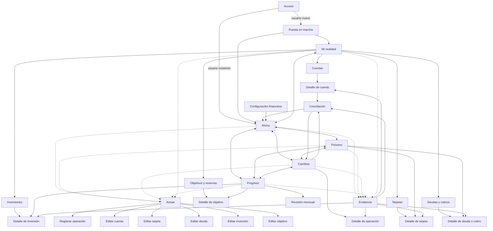

# APP MAP 001 — Mapa Integral del Producto

Estado: oficial  
Fecha: 2 de julio de 2026  
Ámbito: MVP funcional  
Autoridad: mapa único de pantallas, navegación, flujos y alcance  

## 0. Propósito

Este documento reúne Doleth MVP en una vista única.

Consolida:

- navegación oficial;
- pantallas;
- superficies modales;
- asistentes;
- flujos;
- journey del primer mes;
- redundancias eliminadas;
- tamaño real;
- decisión de aprobación.

No agrega teoría ni cambia navegación congelada.

### 0.1 Promesa operativa del MVP

**Una persona puede declarar su posición financiera, mantenerla actualizada, anticipar obligaciones, entender cambios y revisar progreso desde un solo lugar.**

### 0.2 Regla de conteo

Para evitar cifras engañosas:

- **pantalla navegable:** destino estable con contexto propio;
- **asistente:** recorrido guiado con varios pasos y una sola finalidad;
- **modal funcional:** tarea contextual que comienza y termina sin convertirse en destino;
- **estado:** variación de misma pantalla, no pantalla nueva;
- **formulario:** familia de captura con contrato propio; variantes no cuentan como formularios independientes.

---

## 1. Pantallas del MVP

## 1.1 Inventario completo

| ID | Nombre | Tipo | Pregunta o tarea | Entrada principal | Salida natural |
|---|---|---|---|---|---|
| SYS-01 | Acceso | Sistema | ¿Cómo entro a mi espacio financiero? | apertura sin sesión | Puesta en marcha o Ahora |
| PRI-01 | Ahora | Principal | ¿Cómo estoy financieramente en este momento? | entrada habitual | Actuar, Evidencia, Próximo o Mi realidad |
| PRI-02 | Próximo | Principal | ¿Qué viene y qué está cubierto? | navegación primaria o atención desde Ahora | Resolución, detalle relacionado o Ahora |
| PRI-03 | Cambios | Principal | ¿Qué modificó mi situación? | navegación primaria o cifra desde Ahora | Detalle de operación, Evidencia o conciliación |
| PRI-04 | Progreso | Principal | ¿Hacia dónde se mueve mi vida financiera? | navegación primaria o revisión mensual | objetivo, inversión, deuda o revisión mensual |
| PRI-05 | Mi realidad | Principal / Administración | ¿De qué está compuesta mi situación? | navegación estructural o Evidencia | colección de dominio o detalle |
| SEC-01 | Cuentas | Secundaria / Colección | ¿Dónde vive mi dinero? | Mi realidad | detalle de cuenta o editor |
| SEC-02 | Tarjetas | Secundaria / Colección | ¿Qué consumo financiado tengo? | Mi realidad o Próximo | detalle de tarjeta o editor |
| SEC-03 | Deudas y cobros | Secundaria / Colección | ¿Qué debo y qué me deben? | Mi realidad, Próximo o Progreso | detalle de relación o editor |
| SEC-04 | Inversiones | Secundaria / Colección | ¿Qué capital invertido tengo? | Mi realidad o Progreso | detalle de inversión o editor |
| SEC-05 | Objetivos y reservas | Secundaria / Colección | ¿Qué dinero tiene propósito? | Mi realidad o Progreso | detalle de objetivo o editor |
| DET-01 | Detalle de operación | Detalle | ¿Qué ocurrió y qué cambió? | Cambios o Evidencia | corregir, anular, volver a origen |
| DET-02 | Detalle de cuenta | Detalle | ¿Cuál es el estado de esta cuenta? | Cuentas, Ahora o Evidencia | mover, actualizar, conciliar |
| DET-03 | Detalle de tarjeta | Detalle | ¿Qué debo, qué consumí y qué vence? | Tarjetas, Próximo o Evidencia | comprar, pagar, editar |
| DET-04 | Detalle de deuda o cobro | Detalle | ¿Cuál es saldo, condición y próxima acción? | Deudas, Próximo, Progreso o Evidencia | pagar, cobrar, editar |
| DET-05 | Detalle de inversión | Detalle | ¿Cómo se compone y valúa esta posición? | Inversiones, Progreso o Evidencia | operar, actualizar valor, editar |
| DET-06 | Detalle de objetivo | Detalle | ¿Cuánto reservé y cuánto falta? | Objetivos o Progreso | aportar, retirar, editar |
| CFG-01 | Configuración financiera | Configuración | ¿Qué criterios usa Doleth para leer mi realidad? | identidad de usuario | guardar y volver a contexto anterior |
| ASI-01 | Puesta en marcha | Asistente | ¿Qué mínimo necesito declarar para comenzar? | primer acceso | Ahora |
| ASI-02 | Revisión mensual | Asistente | ¿El mes está completo y qué cambió? | Progreso o fin de período | Progreso y Ahora actualizados |
| ASI-03 | Conciliación | Asistente | ¿Por qué una cifra no coincide? | Cambios, detalle o Evidencia | objeto corregido y contexto original |
| MOD-01 | Actuar | Modal | ¿Qué necesito hacer? | cualquier territorio | acción elegida o cancelación al mismo contexto |
| MOD-02 | Registrar operación | Modal / Formulario | ¿Qué ocurrió? | Actuar o contexto de objeto | contexto de origen actualizado |
| MOD-03 | Agregar o editar cuenta | Modal / Formulario | ¿Qué cuenta es y cuál es su saldo? | Cuentas, Mi realidad o puesta en marcha | detalle de cuenta o Ahora |
| MOD-04 | Agregar o editar tarjeta | Modal / Formulario | ¿Qué tarjeta es y cómo funciona? | Tarjetas, Mi realidad o puesta en marcha | detalle de tarjeta o Próximo |
| MOD-05 | Agregar o editar deuda | Modal / Formulario | ¿Quién debe, cuánto y bajo qué condiciones? | Deudas, Mi realidad o puesta en marcha | detalle de deuda o Próximo |
| MOD-06 | Agregar o editar inversión | Modal / Formulario | ¿Qué posición existe y cómo se originó? | Inversiones, Mi realidad o puesta en marcha | detalle de inversión o Progreso |
| MOD-07 | Actualizar valuación | Modal / Formulario | ¿Cuánto vale ahora y con qué fecha? | inversión, Progreso o Evidencia | contexto de origen actualizado |
| MOD-08 | Agregar o editar objetivo | Modal / Formulario | ¿Qué quiero reservar y cuánto? | Objetivos, Progreso o Mi realidad | detalle de objetivo o Progreso |
| MOD-09 | Evidencia | Modal / Confianza | ¿De dónde sale esta respuesta? | cualquier unidad de sentido material | objeto, operación, resolución o contexto original |

## 1.2 Clasificación cuantitativa

| Categoría | Cantidad | Elementos |
|---|---:|---|
| Principales | 5 | Ahora, Próximo, Cambios, Progreso, Mi realidad |
| Secundarias | 5 | Cuentas, Tarjetas, Deudas y cobros, Inversiones, Objetivos y reservas |
| Detalle | 6 | operación, cuenta, tarjeta, deuda/cobro, inversión, objetivo |
| Configuración | 1 | Configuración financiera |
| Asistentes | 3 | puesta en marcha, revisión mensual, conciliación |
| Modales funcionales | 9 | Actuar, operación, cinco editores de dominio, valuación, Evidencia |
| Sistema | 1 | Acceso |
| **Total** | **30** | superficies funcionales distintas |

## 1.3 Qué no tiene pantalla propia

No crean destinos independientes:

- ingreso;
- gasto;
- transferencia;
- compra con tarjeta;
- pago de tarjeta;
- pago de deuda;
- cobro de préstamo;
- aporte a objetivo;
- retiro de reserva;
- compra o venta de inversión;
- ajuste de saldo;
- filtros;
- búsqueda;
- estado vacío;
- error;
- confirmación.

Son variantes de Actuar, Registrar operación, asistentes o estados de pantallas existentes.

---

## 2. Mapa de navegación

## 2.1 Mapa global



## 2.2 Caminos principales

### Orientación

```text
Acceso -> Ahora -> Evidencia opcional -> cierre
```

### Preparación

```text
Ahora -> Próximo -> compromiso -> Resolución -> Próximo -> Ahora
```

### Comprensión

```text
Ahora -> Cambios -> operación -> Evidencia -> volver a Cambios
```

### Progreso

```text
Ahora -> Progreso -> dimensión -> detalle -> volver a Progreso
```

### Administración directa

```text
Mi realidad -> colección -> detalle -> Actuar -> detalle -> Mi realidad
```

### Corrección

```text
Cifra conflictiva -> Evidencia -> Conciliación -> objeto corregido -> contexto original
```

### Acción rápida

```text
Cualquier territorio -> Actuar -> formulario contextual -> resultado -> mismo territorio
```

## 2.3 Regla de retorno

Toda acción vuelve a contexto que la originó.

Excepciones:

- primera configuración termina en Ahora;
- creación de objeto puede terminar en detalle recién creado;
- revisión mensual termina en Progreso y actualiza Ahora;
- conciliación puede terminar en Cambios cuando necesita mostrar corrección.

## 2.4 Caminos prohibidos

1. `Ahora -> lista completa de módulos` como paso obligatorio.
2. `Actuar -> territorio no relacionado` después de guardar.
3. `Próximo -> hecho esperado registrado automáticamente como realizado`.
4. `Cambios -> proyección` mezclada con actividad real.
5. `Progreso -> creación de movimiento` sin pasar por Actuar.
6. `Evidencia -> nueva conclusión` sin volver a Unidad de sentido correspondiente.
7. `Mi realidad -> respuesta global` que compita con Ahora.
8. `Detalle -> detalle no relacionado` sin vínculo financiero explícito.
9. `Modal -> modal -> modal` como cadena de navegación.
10. `Asistente -> configuración avanzada` antes de entregar primer valor.
11. `Atención -> producto comercial` como resolución.
12. `Guardar -> pantalla vacía` sin confirmar efecto.
13. `Cancelar -> perder contexto`.
14. `Eliminar -> borrar historia vinculada` sin explicar consecuencia.
15. `Acceso -> carga total obligatoria` antes de Ahora.

---

## 3. Flujos principales

MVP contiene 15 flujos completos.

## 3.1 Activar espacio financiero

```text
Acceso
-> moneda y fecha inicial
-> primera cuenta
-> saldo confirmado
-> Ahora parcial
```

Resultado: primera respuesta útil sin cargar vida completa.

## 3.2 Completar posición inicial

```text
Ahora parcial
-> Puesta en marcha
-> agregar cuentas, tarjeta, deuda e inversión existentes
-> revisar resumen
-> Ahora ampliado
```

Resultado: posición conocida y faltantes explícitos.

## 3.3 Consultar estado actual

```text
Acceso o navegación primaria
-> Ahora
-> leer disponible, cobertura y confianza
-> abrir Evidencia si necesita comprobar
-> actuar o cerrar
```

Resultado: orientación útil incluso sin registrar ni modificar información.

## 3.4 Registrar entrada de dinero

```text
Actuar
-> Registrar operación: ingreso
-> monto, cuenta y fecha
-> confirmar
-> Ahora y Cambios actualizados
```

## 3.5 Registrar consumo

```text
Actuar
-> Registrar operación: gasto
-> elegir cuenta, efectivo o tarjeta
-> completar contexto mínimo
-> confirmar
-> Ahora, Cambios y Próximo actualizados según medio
```

## 3.6 Mover dinero propio

```text
Actuar
-> Registrar operación: transferencia
-> origen y destino
-> conversión si corresponde
-> confirmar
-> Ahora conserva patrimonio y actualiza ubicación
```

## 3.7 Administrar tarjeta y cuotas

```text
Mi realidad
-> Tarjetas
-> agregar tarjeta
-> registrar compra
-> definir cuotas
-> Próximo incorpora vencimientos
-> registrar pago desde compromiso o detalle
```

Resultado: compra se cuenta una vez; cuotas y pago quedan vinculados.

## 3.8 Administrar deuda o cobro

```text
Mi realidad
-> Deudas y cobros
-> definir quién debe a quién
-> saldo y calendario
-> Próximo incorpora fechas
-> pagar o cobrar
-> saldo pendiente actualizado
```

## 3.9 Administrar inversión

```text
Mi realidad
-> Inversiones
-> agregar posición existente o compra
-> registrar costo y cantidad
-> actualizar valuación
-> Ahora y Progreso actualizados
```

## 3.10 Administrar objetivo y reserva

```text
Progreso o Mi realidad
-> crear objetivo
-> definir monto
-> asignar dinero existente
-> Ahora reduce disponible sin reducir patrimonio
-> Progreso muestra avance
```

## 3.11 Resolver atención actual

```text
Ahora
-> Atención
-> Evidencia opcional
-> Resolución contextual
-> confirmar
-> Ahora sin atención o con estado actualizado
```

## 3.12 Preparar próximos siete días

```text
Próximo
-> revisar compromisos ordenados
-> confirmar cobertura
-> pagar, cobrar o corregir
-> volver a síntesis de Próximo
```

## 3.13 Entender un cambio

```text
Cambios
-> seleccionar variación
-> ver operaciones causales
-> abrir Evidencia
-> corregir si corresponde
-> volver a Cambios
```

## 3.14 Conciliar una diferencia

```text
Estado conflictivo
-> Evidencia
-> Conciliación
-> identificar faltante, duplicado o ajuste
-> confirmar corrección
-> cifra verificada
```

## 3.15 Revisar y cerrar primer mes

```text
Progreso
-> Revisión mensual
-> validar cuentas, tarjetas, deudas e inversiones
-> resolver pendientes materiales
-> entender flujo y cambio de posición
-> confirmar corte
-> Progreso y Ahora actualizados
```

## 3.16 Reglas comunes de flujo

- resultado aparece antes de pedir nueva acción;
- acción conserva contexto de origen;
- campo opcional no bloquea hecho principal;
- usuario puede salir sin guardar;
- corrección no borra trazabilidad;
- Estado actualizado se refleja en territorios relacionados;
- Evidencia permanece disponible después de acción;
- flujo no exige visitar módulo si contexto ya identifica objeto.

---

## 4. User Journey del primer mes

Journey describe maduración de valor. No funciona como checklist obligatorio.

## Día 1 — Primera posición

### Usuario hace

- accede;
- elige moneda principal;
- agrega cuenta más importante y efectivo si corresponde;
- confirma saldos;
- llega a Ahora.

### Doleth entrega

- dinero líquido conocido;
- disponible parcial;
- estado de cobertura;
- faltantes declarados, no ceros falsos.

### Transformación

De “no sé cuánto tengo” a “sé qué parte de mi dinero ya está representada”.

## Días 2 y 3 — Primer ciclo operativo

### Usuario hace

- registra entrada o gasto;
- mueve dinero entre cuentas;
- abre Cambios;
- consulta Evidencia de cifra actualizada.

### Doleth entrega

- efecto único del hecho en Ahora;
- cronología comprensible;
- transferencia sin falso ingreso o gasto;
- confianza en relación entre acción y resultado.

### Transformación

De fotografía estática a sistema vivo.

## Días 4 a 7 — Obligaciones reales

### Usuario hace

- agrega tarjeta;
- carga compra en cuotas;
- registra deuda o cobro pendiente;
- abre Próximo;
- registra primer pago.

### Doleth entrega

- próximos vencimientos;
- cobertura inmediata;
- deuda actualizada;
- compra y pago sin doble conteo.

### Transformación

De conocer saldos a comprender presión financiera.

## Semana 2 — Capital y propósito

### Usuario hace

- agrega inversión principal;
- confirma valuación;
- crea objetivo o reserva si existe;
- consulta Progreso.

### Doleth entrega

- posición más completa;
- separación entre liquidez e inversión;
- dinero reservado sin duplicación;
- primera lectura de dirección.

### Transformación

De control cotidiano a visión integral.

## Semana 3 — Confianza

### Usuario hace

- actualiza saldo;
- resuelve diferencia;
- corrige operación;
- revisa Evidencia;
- confirma próximos compromisos.

### Doleth entrega

- cobertura más confiable;
- pendientes localizados;
- historial preservado;
- Ahora sin ruido innecesario.

### Transformación

De información reunida a información confiable.

## Semana 4 — Primer cierre

### Usuario hace

- inicia Revisión mensual;
- valida cuentas, tarjetas, deudas e inversiones;
- revisa qué cambió;
- observa Progreso;
- confirma corte.

### Doleth entrega

- flujo del mes;
- variación de posición;
- deuda y capital al cierre;
- asuntos pendientes explícitos;
- base limpia para mes siguiente.

### Transformación

De uso diario fragmentado a memoria financiera personal.

## Fin del primer mes

Usuario puede responder:

- cuánto tiene disponible;
- qué debe cubrir;
- qué cambió;
- qué posee y debe;
- qué dinero está reservado;
- cómo terminó mes;
- qué información necesita revisión.

MVP demuestra promesa cuando respuestas surgen de mismo conjunto de hechos y pueden verificarse.

---

## 5. Redundancias y simplificación

## 5.1 Reducciones respecto de mapa anterior

| Elemento anterior | Decisión | Resultado |
|---|---|---|
| Inicio / Panorama | reemplazado por Ahora | una pregunta presente, sin dashboard genérico |
| Actividad + Flujo del período | fusionados en Cambios | hechos y explicación comparten territorio |
| Posición + panorama patrimonial | fusionados en Mi realidad y Ahora | administración separada de orientación |
| Agenda | reemplazada por Próximo | compromiso se organiza por pregunta humana |
| Reportes + reporte mensual | distribuidos entre Cambios, Progreso y Revisión mensual | sin hub vacío de reportes |
| Resumen inicial | absorbido por primer estado de Ahora | onboarding entrega valor sin pantalla intermedia |
| Estado de información + revisar saldo | fusionados en Evidencia y Conciliación | una ruta de confianza |
| Agregar ingreso, gasto y transferencia | fusionados en Registrar operación | un formulario adaptativo |
| Compra, pago de tarjeta y pago de deuda | variantes contextuales de operación | menos rutas y retorno correcto |
| Evidencias por módulo | fusionadas en Evidencia | explicación consistente en toda app |

Resultado:

- mapa anterior: 36 pantallas y 23 flujos;
- mapa actual: 30 superficies y 15 flujos principales;
- reducción: 6 superficies y 8 flujos duplicados o demasiado específicos.

## 5.2 Pantallas que comparten patrón sin fusionarse semánticamente

### Colecciones de dominio

Cuentas, Tarjetas, Deudas, Inversiones y Objetivos usan mismo patrón de Colección.

No deben fusionarse en una lista universal porque:

- preguntas son distintas;
- estados son distintos;
- acciones son distintas;
- orden relevante es distinto.

### Detalles

Detalles comparten estructura:

```text
Estado
-> Composición
-> Secuencia
-> Evidencia
-> Actuar
```

No se fusionan como experiencia única porque cuenta, tarjeta y deuda no significan lo mismo.

### Editores

Editores comparten contexto, validación y confirmación. Mantienen campos y consecuencias propios.

## 5.3 Flujos acortados

### Crear y usar

Después de crear tarjeta, deuda, inversión u objetivo, usuario puede ejecutar primera acción sin volver a colección.

### Resolver desde atención

Pago o actualización comienza desde Atención sin pasar por Mi realidad.

### Corregir desde evidencia

Evidencia abre Conciliación directamente cuando detecta conflicto.

### Registrar desde contexto

Desde detalle, Actuar hereda objeto. No vuelve a pedir qué tarjeta, deuda o cuenta.

### Onboarding progresivo

Primera cuenta habilita Ahora. Tarjetas, deudas e inversiones se agregan después.

## 5.4 Simplificaciones obligatorias

- máximo una acción principal por paso;
- no más de dos niveles modales;
- no pantalla separada para confirmación;
- no selector de módulo antes de Actuar;
- no categoría obligatoria para registrar gasto;
- no calendario completo dentro de Ahora;
- no reporte independiente cuando Cambios o Progreso responden pregunta;
- no configuración avanzada durante primer mes;
- no duplicar dato para mostrarlo en otro territorio.

---

## 6. Tamaño real del MVP

## 6.1 Superficies

| Medida | Cantidad |
|---|---:|
| Pantallas navegables | 18 |
| Asistentes | 3 |
| Modales funcionales | 9 |
| **Total de superficies** | **30** |

Pantallas navegables incluyen:

- 1 de sistema;
- 5 principales;
- 5 secundarias;
- 6 de detalle;
- 1 de configuración.

## 6.2 Flujos

| Medida | Cantidad |
|---|---:|
| Flujos principales end-to-end | 15 |
| Flujos de activación | 2 |
| Flujo de consulta | 1 |
| Flujos operativos | 7 |
| Flujos de comprensión y confianza | 4 |
| Flujo de cierre | 1 |

Los 15 son:

1. activar espacio;
2. completar posición;
3. consultar estado actual;
4. registrar entrada;
5. registrar consumo;
6. transferir;
7. administrar tarjeta;
8. administrar deuda o cobro;
9. administrar inversión;
10. administrar objetivo;
11. resolver atención;
12. preparar próximos siete días;
13. entender cambio;
14. conciliar diferencia;
15. cerrar mes.

## 6.3 Formularios

MVP tiene **9 familias de formulario**.

| Familia | Modos principales | Cantidad |
|---|---|---:|
| Perfil financiero inicial | configuración inicial | 1 |
| Cuenta | efectivo, banco, billetera | 3 |
| Operación | ingreso, gasto, transferencia, compra, pago, cobro, aporte, retiro, operación de inversión | 9 |
| Tarjeta | alta o edición bajo mismo modo | 1 |
| Deuda o cobro | yo debo, me deben | 2 |
| Inversión | posición existente, operación nueva | 2 |
| Valuación | inversión, saldo manual | 2 |
| Objetivo o reserva | objetivo, reserva, aporte inicial | 3 |
| Conciliación | faltante, duplicado, ajuste | 3 |

Total: **9 familias, 26 variantes funcionales**.

Variantes no deben diseñarse como formularios independientes. Comparten orden y revelan campos según significado.

## 6.4 Tipos de bloques

MVP usa **10 tipos oficiales** de `DESIGN LANGUAGE 001`:

1. Síntesis.
2. Estado.
3. Atención.
4. Composición.
5. Comparación.
6. Secuencia.
7. Progreso.
8. Colección.
9. Evidencia.
10. Resolución.

No necesita tipo adicional.

## 6.5 Patrones estructurales

Treinta superficies se construyen con ocho patrones:

1. territorio principal;
2. colección;
3. detalle;
4. asistente;
5. editor contextual;
6. Evidencia;
7. configuración;
8. acceso.

Cantidad de superficies no equivale a treinta diseños independientes.

## 6.6 Alcance explícitamente fuera

- sincronización bancaria;
- importación histórica;
- patrimonio físico;
- colaboración o cuentas compartidas;
- presupuesto avanzado;
- escenarios y proyecciones;
- impuestos;
- reportes personalizados;
- automatizaciones complejas;
- recurrencias configurables avanzadas;
- valuaciones automáticas;
- múltiples ámbitos simultáneos;
- exportación y respaldo administrables;
- búsqueda global;
- recomendaciones financieras.

MVP conserva:

- carga manual completa;
- multimoneda básica;
- efectivo, bancos y billeteras;
- tarjetas y cuotas;
- deudas y cobros;
- inversiones manuales;
- objetivos y reservas;
- posición, próximos compromisos, cambios y progreso;
- Evidencia y conciliación básica.

---

## 7. Evaluación crítica

## 7.1 Veredicto

**Sí. Aprobaría este MVP para comenzar diseño visual y desarrollo.**

No aprobaría regreso a especificación ni ampliación funcional.

## 7.2 Por qué se aprueba

### Promesa verificable

Usuario puede pasar de desorden disperso a posición financiera comprensible y mantenible.

### Core loop claro

```text
Declarar realidad
-> verla en Ahora
-> actuar
-> entender cambio
-> preparar próximo
-> revisar progreso
```

### Diferenciación visible

Producto no se organiza como tracker de gastos ni lista de módulos. Organiza experiencia por preguntas y conserva administración profunda.

### Alcance amplio pero cerrado

Tarjetas, deuda, inversiones y objetivos entran porque son necesarios para promesa integral. Automatización, sincronización y patrimonio físico esperan.

### Riesgos principales ya tienen respuesta

- doble conteo: operación única;
- complejidad: gramática de diez bloques;
- navegación inflada: cinco territorios;
- confianza: Evidencia y conciliación;
- onboarding largo: primera cuenta entrega valor;
- formularios múltiples: nueve familias adaptativas.

### Primer mes tiene arco completo

MVP no termina en registro. Termina en revisión mensual confiable.

## 7.3 Condiciones de aprobación

1. No agregar pantallas fuera de este mapa sin eliminar o fusionar otra.
2. No convertir variantes de operación en pantallas propias.
3. No incluir sincronización en primera versión.
4. No exigir carga completa antes de Ahora.
5. No diseñar cada dominio como producto aislado.
6. No usar gráficos para compensar falta de respuesta.
7. Toda cifra material debe abrir Evidencia.
8. Transferencia, pago de tarjeta y compra de inversión deben evitar doble conteo.
9. Flujo completo debe funcionar con carga manual.
10. Primer corte mensual debe ser posible sin salir de Doleth.

## 7.4 Riesgo restante

Treinta superficies siguen siendo MVP grande.

Riesgo no se resuelve eliminando dominios centrales. Se controla construyendo por cortes verticales.

### Corte 1 — Verdad básica

- Acceso;
- Puesta en marcha;
- Ahora;
- Mi realidad;
- Cuentas;
- detalle de cuenta;
- Actuar;
- Registrar operación;
- Evidencia;
- Cambios.

Demuestra: una cuenta y un hecho actualizan posición verificable.

### Corte 2 — Obligaciones

- Próximo;
- Tarjetas;
- Deudas y cobros;
- detalles y editores;
- pagos;
- Conciliación.

Demuestra: producto entiende presión futura y no duplica consumo.

### Corte 3 — Capital y cierre

- Inversiones;
- Objetivos;
- Progreso;
- valuación;
- Revisión mensual;
- Configuración final.

Demuestra: producto conecta cotidiano, capital, propósito e historia.

## 7.5 Qué falta antes de comenzar

No falta otro documento estratégico.

Falta trabajo de diseño y validación, ya dentro de nueva fase:

1. definir baja fidelidad de Corte 1;
2. probar recorrido con datos financieros realistas;
3. validar comprensión de disponible, cobertura y Evidencia;
4. fijar lenguaje de formularios;
5. diseñar estados vacío, parcial, confirmado y conflictivo;
6. comenzar desarrollo del mismo corte.

Esto no bloquea inicio. Es trabajo inicial de fase aprobada.

## 7.6 Criterio para no expandir

Nueva capacidad solo entra si MVP no puede cumplir una de estas promesas sin ella:

- conocer posición actual;
- mantenerla con hechos reales;
- anticipar obligación;
- explicar cambio;
- verificar cifra;
- revisar mes.

Si no desbloquea una de esas seis, espera.

---

## 8. Declaración de fase

APP MAP 001 establece alcance integral del MVP:

```text
30 superficies
15 flujos principales
9 familias de formularios
26 variantes funcionales
10 tipos de bloques
8 patrones estructurales
```

Decisión oficial:

**Doleth está listo para comenzar diseño visual y desarrollo mediante tres cortes verticales, empezando por Verdad básica.**

Etapa de especificación funcional general queda cerrada. Próximo trabajo debe producir experiencia visible y producto ejecutable, no nuevos documentos estratégicos.
