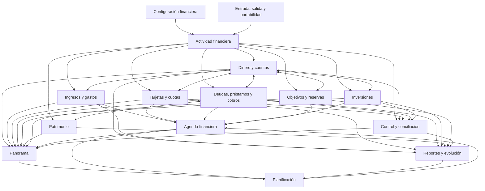

# DOLETH PRODUCT BLUEPRINT

Estado: oficial  
Fecha: 2 de julio de 2026  
Autoridad: plano maestro funcional del producto  
Depende de: `PRD-002` y `SPEC-AUDIT-001`  

## 0. Mandato

Este documento define qué producto debe construirse, cómo se divide, qué responsabilidad pertenece a cada parte y en qué orden debe desarrollarse.

No agrega teoría. No modifica especificación congelada. Traduce esa especificación a una arquitectura funcional de producto.

Definición operativa:

**Doleth es una aplicación para registrar, mantener, entender y administrar toda la vida financiera de una persona desde un solo lugar.**

Resultado esperado para usuario:

**Cuando cierro Doleth, sé exactamente dónde estoy parado.**

### 0.1 Regla de organización

Doleth se organiza en tres capas:

1. **Núcleo operativo:** registra hechos y mantiene verdad financiera.
2. **Dominios financieros:** permiten administrar cada parte de vida financiera.
3. **Síntesis y control:** consolidan, comparan, proyectan y verifican realidad completa.

Los módulos son límites de responsabilidad. No implican pantallas, menús ni componentes.

---

## 1. Módulos completos del producto

### 1.1 Actividad financiera

Registro operativo común de todo hecho que cambia o explica realidad financiera.

### 1.2 Dinero y cuentas

Administración de efectivo, bancos, billeteras, saldos y transferencias entre lugares propios.

### 1.3 Ingresos y gastos

Administración de flujo financiero cotidiano, fuentes, destinos, recurrencias y comportamiento por período.

### 1.4 Tarjetas y cuotas

Administración de consumo financiado, límites, cierres, vencimientos, resúmenes, cuotas y pagos.

### 1.5 Deudas, préstamos y cobros

Administración de obligaciones propias y derechos de cobro, formales o informales.

### 1.6 Inversiones

Administración de posiciones financieras, operaciones, rendimientos, valuaciones y composición de cartera.

### 1.7 Patrimonio

Administración de activos no financieros y lectura de patrimonio neto total.

### 1.8 Objetivos y reservas

Administración de dinero separado por propósito, metas de ahorro y fondos protegidos.

### 1.9 Agenda financiera

Administración temporal de próximos cobros, pagos, vencimientos, cierres, cuotas, renovaciones y compromisos.

### 1.10 Panorama

Síntesis actual de liquidez, obligaciones, inversiones, patrimonio, flujo y cambios relevantes.

### 1.11 Reportes y evolución

Lectura histórica, comparación entre períodos y explicación cuantitativa de cambios.

### 1.12 Planificación

Proyección de escenarios futuros usando posición actual, compromisos conocidos y decisiones declaradas por usuario.

### 1.13 Control y conciliación

Verificación de integridad, actualización y consistencia de información financiera.

### 1.14 Entrada, salida y portabilidad

Ingreso de información desde distintos orígenes, exportación completa y conservación de propiedad sobre datos.

### 1.15 Configuración financiera

Definición de monedas, criterios de valuación, ámbitos financieros, preferencias y reglas personales compartidas por producto.

---

## 2. Responsabilidades por módulo

## 2.1 Actividad financiera

### Responsabilidad

Mantener cronología única de hechos financieros sin obligar a cada dominio a conservar historial separado.

### Debe permitir

- registrar ingresos, gastos, transferencias, compras, ventas, cobros, pagos, ajustes y revaluaciones;
- representar operaciones simples y compuestas;
- dividir un hecho en partes cuando afecta más de un propósito o dominio;
- vincular hechos relacionados, como compra con tarjeta y pago posterior;
- corregir, anular o reemplazar registros sin perder trazabilidad;
- adjuntar contexto, contraparte, comprobante y notas;
- consultar qué cambió, cuándo, dónde y por qué.

### No debe asumir

- que toda entrada es ingreso;
- que toda salida es gasto;
- que toda transferencia cambia patrimonio;
- que toda variación de valor produce flujo;
- que un movimiento pertenece a un solo módulo.

### Entidades de producto

- actividad;
- operación;
- parte de operación;
- fecha efectiva;
- fecha registrada;
- origen;
- destino;
- monto;
- moneda;
- contraparte;
- comprobante;
- vínculo entre operaciones;
- estado de registro.

## 2.2 Dinero y cuentas

### Responsabilidad

Responder cuánto dinero existe, dónde está, en qué moneda y cuánto puede utilizarse.

### Debe permitir

- administrar efectivo, bancos, billeteras y otras tenencias monetarias;
- crear, actualizar, archivar y conciliar cuentas;
- registrar saldos iniciales y ajustes;
- transferir entre cuentas propias sin crear ingresos ni gastos falsos;
- consolidar por cuenta, tipo, moneda y ámbito;
- distinguir saldo total, saldo disponible y dinero reservado;
- identificar dinero pendiente de acreditación o bloqueado;
- mantener historial de saldos.

### Entidades de producto

- cuenta;
- efectivo;
- billetera;
- institución;
- moneda;
- saldo;
- disponibilidad;
- titularidad;
- ámbito;
- transferencia;
- ajuste;
- conciliación.

## 2.3 Ingresos y gastos

### Responsabilidad

Explicar cómo entra y sale valor durante cada período y qué parte corresponde a actividad habitual o extraordinaria.

### Debe permitir

- registrar ingresos y gastos;
- identificar fuente, destino, categoría y contraparte;
- diferenciar fijo, variable, recurrente y extraordinario;
- administrar suscripciones y otros gastos periódicos;
- distribuir una operación entre categorías o ámbitos;
- separar fecha económica, fecha de pago y período al que corresponde;
- revisar flujo actual y compararlo con períodos anteriores;
- mostrar ingreso, gasto y ahorro del período sin confundir transferencias o inversiones con consumo;
- corregir clasificaciones sin alterar hecho original.

### Entidades de producto

- ingreso;
- gasto;
- fuente;
- categoría;
- contraparte;
- recurrencia;
- suscripción;
- período;
- asignación;
- reembolso;
- devolución;
- flujo neto.

## 2.4 Tarjetas y cuotas

### Responsabilidad

Mostrar consumo financiado actual y carga futura derivada de tarjetas.

### Debe permitir

- administrar tarjetas propias y adicionales;
- registrar consumos, devoluciones, impuestos, intereses y cargos;
- registrar compras en una o varias cuotas;
- mantener calendario de cierres y vencimientos;
- consolidar resumen por período;
- registrar pago total, parcial, mínimo o refinanciado;
- controlar límite total, disponible y comprometido;
- distinguir consumo realizado, cuota próxima y deuda exigible;
- vincular pago con cuenta de origen y deuda extinguida;
- seguir consumos compartidos o atribuibles a otra persona.

### Entidades de producto

- tarjeta;
- emisor;
- titular;
- adicional;
- límite;
- consumo;
- plan de cuotas;
- cuota;
- cierre;
- vencimiento;
- resumen;
- pago;
- financiación;
- devolución;
- cargo.

## 2.5 Deudas, préstamos y cobros

### Responsabilidad

Administrar lo que usuario debe, lo que otros le deben y cómo esas relaciones cambian con tiempo y pagos.

### Debe permitir

- registrar deuda bancaria, personal, comercial e informal;
- registrar dinero prestado a terceros y otros derechos de cobro;
- definir principal, moneda, tasa, condiciones y calendario;
- registrar desembolsos, pagos, cobros, intereses, cargos y condonaciones;
- ver saldo pendiente y próxima obligación;
- separar capital de costo financiero;
- representar mora, refinanciación, pago parcial e incumplimiento;
- vincular cada pago o cobro con cuenta correspondiente;
- mostrar efecto sobre liquidez y patrimonio.

### Entidades de producto

- deuda;
- préstamo recibido;
- préstamo otorgado;
- acreedor;
- deudor;
- principal;
- tasa;
- condición;
- plan de pago;
- vencimiento;
- pago;
- cobro;
- interés;
- mora;
- condonación;
- garantía.

## 2.6 Inversiones

### Responsabilidad

Mantener cartera completa y separar capital invertido, rendimiento, exposición y disponibilidad.

### Debe permitir

- administrar cuentas de inversión y custodios;
- registrar compra, venta, suscripción, rescate, depósito y retiro;
- administrar acciones, CEDEARs, ETFs, bonos, fondos, plazos fijos, criptomonedas, dólares y otros instrumentos;
- registrar dividendos, intereses, cupones, comisiones e impuestos;
- mantener cantidad, costo, valor actual y resultado;
- separar rendimiento realizado y no realizado;
- consolidar por instrumento, clase, moneda, custodio y ámbito;
- representar conversiones y canjes sin falso ingreso o gasto;
- mantener criterio y fecha de cada valuación;
- mostrar liquidez de cada posición.

### Entidades de producto

- cuenta de inversión;
- custodio;
- instrumento;
- clase de activo;
- posición;
- cantidad;
- costo;
- precio;
- valuación;
- compra;
- venta;
- rendimiento;
- distribución;
- comisión;
- exposición;
- vencimiento.

## 2.7 Patrimonio

### Responsabilidad

Representar activos relevantes que forman riqueza, aunque no sean dinero ni inversión financiera.

### Debe permitir

- administrar propiedades, vehículos, equipos, participaciones y otros activos;
- registrar adquisición, mejora, deterioro, venta y baja;
- mantener titularidad individual o compartida;
- registrar valor, criterio, fuente y fecha de valuación;
- asociar deuda o garantía con activo;
- distinguir costo, valor estimado y valor realizable;
- mostrar contribución al patrimonio neto sin presentarla como liquidez;
- conservar historial de valuaciones.

### Entidades de producto

- activo patrimonial;
- tipo de activo;
- titularidad;
- porcentaje de participación;
- costo;
- valuación;
- mejora;
- deterioro;
- garantía;
- deuda asociada;
- adquisición;
- disposición.

## 2.8 Objetivos y reservas

### Responsabilidad

Separar valor por propósito y mostrar avance sin crear dinero inexistente.

### Debe permitir

- crear objetivos con monto, moneda, prioridad y fecha opcional;
- crear reservas permanentes o temporales;
- asignar dinero existente desde una o varias cuentas;
- liberar, reasignar o consumir dinero reservado;
- registrar aportes y retiros;
- distinguir monto objetivo, monto asignado y disponibilidad real;
- seguir avance y ritmo histórico;
- vincular objetivo con compra, viaje, emergencia u otro uso final;
- evitar doble conteo entre saldo de cuenta y reserva.

### Entidades de producto

- objetivo;
- reserva;
- propósito;
- prioridad;
- monto objetivo;
- fecha objetivo;
- asignación;
- aporte;
- retiro;
- uso;
- cuenta de respaldo;
- progreso.

## 2.9 Agenda financiera

### Responsabilidad

Reunir todo hecho futuro conocido que pueda afectar posición o requerir acción.

### Debe permitir

- ver próximos ingresos, gastos, cuotas, vencimientos, cierres y renovaciones;
- crear compromisos únicos y recurrentes;
- derivar fechas desde tarjetas, deudas, inversiones, suscripciones y objetivos;
- distinguir previsto, confirmado, vencido, pagado, cobrado y cancelado;
- vincular previsión con hecho realizado;
- detectar compromisos sin cobertura suficiente;
- administrar recordatorios sin duplicar obligación original;
- revisar horizonte diario, semanal, mensual y anual.

### Entidades de producto

- compromiso;
- derecho de cobro;
- fecha;
- recurrencia;
- vencimiento;
- cierre;
- renovación;
- previsión;
- confirmación;
- cumplimiento;
- cobertura.

## 2.10 Panorama

### Responsabilidad

Componer una lectura actual, coherente y accionable de toda vida financiera.

### Debe responder

- cuánto dinero hay y cuánto está disponible;
- qué obligaciones existen y cuáles vencen pronto;
- cómo viene flujo del período;
- cuánto vale patrimonio neto;
- cómo se distribuyen activos y deudas;
- cuánto está reservado;
- qué cambió desde última revisión;
- qué dato importante está desactualizado o sin conciliar.

### Debe permitir

- pasar de síntesis global a dominio que explica cada cifra;
- cambiar moneda de lectura sin alterar valores originales;
- separar posición actual de proyección;
- distinguir información confirmada, estimada y desactualizada;
- elegir ámbitos incluidos en consolidado.

### Entidades de producto

- posición financiera;
- liquidez total;
- liquidez disponible;
- patrimonio neto;
- obligaciones próximas;
- flujo del período;
- ahorro;
- composición;
- variación;
- estado de actualización;
- ámbito consolidado.

## 2.11 Reportes y evolución

### Responsabilidad

Explicar cómo se formó posición actual y cómo cambió a través del tiempo.

### Debe permitir

- revisar flujo por período;
- revisar evolución de patrimonio neto, liquidez, ahorro, deuda e inversiones;
- comparar períodos equivalentes;
- analizar composición de activos, pasivos, ingresos y gastos;
- separar cambios por flujo, transferencia, transformación y revaluación;
- filtrar por moneda, ámbito, cuenta, categoría, contraparte o instrumento;
- reconstruir cifra desde operaciones que la forman;
- guardar cortes históricos consistentes;
- exportar resultados verificables.

### Entidades de producto

- período;
- corte;
- saldo inicial;
- saldo final;
- variación;
- flujo;
- composición;
- comparación;
- serie histórica;
- criterio de valuación;
- moneda de lectura.

## 2.12 Planificación

### Responsabilidad

Permitir que usuario evalúe futuro sin confundir escenario con realidad confirmada.

### Debe permitir

- proyectar posición desde saldos, recurrencias y compromisos conocidos;
- crear escenarios declarados por usuario;
- evaluar compras, cancelaciones de deuda, aportes y cambios de ingreso;
- comparar escenario con línea base;
- mostrar supuestos usados;
- separar proyección, intención y hecho realizado;
- convertir decisión confirmada en compromiso sin alterar pasado;
- actualizar escenario cuando cambia realidad.

### Entidades de producto

- plan;
- escenario;
- línea base;
- supuesto;
- decisión declarada;
- proyección;
- horizonte;
- compromiso propuesto;
- resultado esperado;
- diferencia.

## 2.13 Control y conciliación

### Responsabilidad

Garantizar que lectura global sea confiable y que inconsistencias puedan resolverse.

### Debe permitir

- comparar saldo informado con saldo calculado;
- detectar duplicados, omisiones y operaciones incompletas;
- señalar información desactualizada;
- conciliar cuentas, tarjetas, deudas e inversiones por fecha de corte;
- revisar operaciones pendientes de clasificación o vínculo;
- explicar origen de cada diferencia;
- ajustar sin borrar historia;
- registrar grado de certeza y procedencia de datos;
- cerrar períodos cuando usuario considera información completa;
- reabrirlos con trazabilidad cuando aparece evidencia nueva.

### Entidades de producto

- conciliación;
- corte;
- saldo declarado;
- saldo calculado;
- diferencia;
- duplicado;
- dato pendiente;
- ajuste;
- fuente;
- evidencia;
- certeza;
- estado de actualización.

## 2.14 Entrada, salida y portabilidad

### Responsabilidad

Permitir construir y conservar historia financiera sin dependencia de un único método de carga.

### Debe permitir

- carga manual individual y por lote;
- importación desde archivos y fuentes externas;
- revisión previa antes de incorporar información;
- detección de duplicados durante importación;
- asignación de origen y nivel de confianza;
- exportación por módulo, período o totalidad;
- respaldo y restauración completa;
- migración entre monedas, cuentas o criterios sin pérdida histórica;
- eliminación controlada de origen importado cuando corresponda.

### Entidades de producto

- origen de datos;
- importación;
- lote;
- registro candidato;
- coincidencia;
- duplicado;
- regla de mapeo;
- validación;
- exportación;
- respaldo;
- restauración.

## 2.15 Configuración financiera

### Responsabilidad

Mantener criterios comunes necesarios para que todos los módulos hablen mismo idioma financiero.

### Debe permitir

- definir moneda principal y monedas utilizadas;
- definir ámbitos personales relevantes sin separar verdades incompatibles;
- administrar instituciones, contrapartes, categorías y etiquetas reutilizables;
- elegir criterios de valuación y fuentes de precio;
- definir inicio de períodos y preferencias temporales;
- administrar titularidad y participación compartida;
- controlar qué módulos y ámbitos participan en consolidado;
- mantener reglas de recurrencia, redondeo y conversión;
- archivar elementos sin destruir historia.

### Entidades de producto

- perfil financiero;
- moneda principal;
- moneda;
- ámbito;
- institución;
- contraparte;
- categoría;
- etiqueta;
- criterio de valuación;
- fuente de precio;
- período financiero;
- titularidad;
- preferencia.

---

## 3. Capacidades transversales

Estas capacidades no son módulos independientes. Sirven a varios módulos y deben tener una única definición funcional.

### 3.1 Monedas y conversión

Conserva monto y moneda original. Produce equivalencias para consolidación usando tasa, fuente y fecha explícitas.

La usan: todos los módulos cuantitativos.

### 3.2 Valuación

Mantiene valor de inversiones y patrimonio con criterio, fuente, moneda y fecha. Nunca reemplaza costo ni valor original.

La usan: inversiones, patrimonio, panorama, reportes y planificación.

### 3.3 Clasificación

Administra categorías, etiquetas, contrapartes y ámbitos sin convertirlos en verdad financiera primaria.

La usan: actividad, flujo, tarjetas, deudas, inversiones, reportes y control.

### 3.4 Recurrencia y calendario

Define repetición y materializa próximos hechos esperados sin registrarlos como realizados.

La usan: flujo, tarjetas, deudas, inversiones, objetivos, agenda y planificación.

### 3.5 Evidencia y trazabilidad

Conserva procedencia, comprobantes, correcciones, vínculos y motivos de ajuste.

La usan: actividad, importación, control y todos los dominios que modifican posición.

### 3.6 Ámbitos y titularidad

Permite distinguir personal, compartido, familiar o actividad económica, además de porcentajes de propiedad, sin duplicar valor.

La usan: cuentas, flujo, tarjetas, deudas, inversiones, patrimonio, panorama y reportes.

---

## 4. Mapa completo de relaciones



### 4.1 Relación estructural

`Actividad financiera` registra hechos una vez.

Dominios interpretan y administran efecto correspondiente:

- `Dinero y cuentas` mantiene ubicación y disponibilidad;
- `Ingresos y gastos` mantiene lectura de flujo;
- `Tarjetas y cuotas` mantiene consumo financiado;
- `Deudas, préstamos y cobros` mantiene relaciones pendientes;
- `Inversiones` mantiene posiciones financieras;
- `Patrimonio` mantiene activos no financieros;
- `Objetivos y reservas` mantiene propósito asignado.

`Agenda financiera` reúne consecuencias futuras.

`Panorama` consolida presente.

`Reportes y evolución` explica pasado.

`Planificación` evalúa futuro.

`Control y conciliación` verifica calidad de presente y pasado.

`Entrada, salida y portabilidad` conecta información externa sin convertirse en dueño de verdad financiera.

`Configuración financiera` provee criterios compartidos.

---

## 5. Flujos naturales entre módulos

## 5.1 Incorporación inicial

1. Usuario define moneda principal y ámbitos necesarios.
2. Registra cuentas, efectivo y saldos iniciales.
3. Registra tarjetas, deudas, inversiones y activos relevantes.
4. Declara reservas y objetivos existentes.
5. Doleth consolida primer panorama.
6. Usuario concilia cifras iniciales.

Resultado: primera posición financiera completa y fechada.

## 5.2 Operación cotidiana

1. Hecho entra por actividad o importación.
2. Se identifica origen, destino, monto, moneda y fecha.
3. Dominio correspondiente incorpora efecto.
4. Cuentas y saldos se actualizan.
5. Agenda se ajusta si hecho crea o extingue compromiso futuro.
6. Panorama y reportes recomputan lectura.
7. Control señala inconsistencia si resultado no cierra.

Resultado: un registro produce todos sus efectos sin carga duplicada.

## 5.3 Compra con tarjeta en cuotas

1. Actividad registra compra.
2. Tarjetas crea consumo y plan de cuotas.
3. Ingresos y gastos reconoce consumo una sola vez, en período económico correspondiente, sin registrar pago todavía inexistente.
4. Agenda incorpora cuotas, cierre y vencimientos.
5. Panorama actualiza obligaciones.
6. Pago posterior sale de cuenta y extingue deuda de tarjeta, sin duplicar gasto.

## 5.4 Compra de inversión

1. Actividad registra operación.
2. Dinero reduce saldo de cuenta de origen.
3. Inversiones aumenta posición y conserva costo.
4. Reportes la trata como transformación patrimonial, no como gasto de consumo.
5. Panorama cambia composición y liquidez, no necesariamente patrimonio neto.

## 5.5 Alta de deuda

1. Deudas registra relación, condiciones y calendario.
2. Si existe desembolso, dinero aumenta en cuenta receptora.
3. Actividad vincula entrada con deuda creada.
4. Agenda incorpora pagos futuros.
5. Panorama aumenta liquidez y pasivo sin presentar entrada como ingreso.

## 5.6 Reserva para objetivo

1. Objetivos asigna parte de saldo existente.
2. Dinero conserva ubicación y reduce porción libre.
3. Panorama muestra misma riqueza total con menor disponibilidad.
4. Reportes no registra gasto ni salida.

## 5.7 Cierre periódico

1. Agenda reúne obligaciones y cobros del período.
2. Usuario actualiza o importa hechos faltantes.
3. Control concilia cuentas, tarjetas, deudas e inversiones.
4. Período queda consistente o conserva pendientes explícitos.
5. Reportes genera corte histórico.
6. Panorama inicia período siguiente desde posición verificada.

## 5.8 Evaluación de decisión futura

1. Planificación toma posición conciliada como línea base.
2. Usuario declara decisión o supuesto.
3. Escenario modifica proyección, nunca historia.
4. Panorama proyectado muestra efecto sobre liquidez, deuda, objetivos y patrimonio.
5. Si usuario confirma decisión, agenda crea compromiso.
6. Solo hecho realizado entra en actividad.

---

## 6. Información compartida

| Información | Propietario funcional | Consumidores principales |
|---|---|---|
| Operaciones realizadas | Actividad financiera | todos los dominios, control, reportes |
| Cuentas y saldos | Dinero y cuentas | panorama, flujo, tarjetas, deudas, inversiones, objetivos, planificación |
| Flujo por período | Ingresos y gastos | panorama, reportes, planificación |
| Consumos y obligaciones de tarjeta | Tarjetas y cuotas | agenda, panorama, reportes, planificación |
| Saldos de deudas y cobros | Deudas, préstamos y cobros | agenda, panorama, patrimonio, reportes, planificación |
| Posiciones y valuaciones financieras | Inversiones | panorama, reportes, planificación |
| Activos y valuaciones patrimoniales | Patrimonio | panorama, reportes, planificación |
| Asignaciones y metas | Objetivos y reservas | dinero, agenda, panorama, reportes, planificación |
| Próximos hechos conocidos | Agenda financiera | panorama, planificación |
| Cortes y series históricas | Reportes y evolución | panorama, planificación |
| Diferencias y estado de actualización | Control y conciliación | panorama, reportes, dominios afectados |
| Monedas, ámbitos y criterios comunes | Configuración financiera | todos los módulos |
| Origen y lotes de datos | Entrada, salida y portabilidad | actividad, control |

### 6.1 Regla de propiedad

Cada dato tiene un solo propietario funcional.

Otros módulos pueden:

- consumirlo;
- derivar una lectura;
- enlazarlo;
- solicitar corrección a módulo propietario.

No pueden mantener copia independiente que compita con verdad original.

### 6.2 Reglas de sincronización conceptual

- Pago de tarjeta modifica cuenta y obligación; no crea segundo gasto.
- Transferencia propia modifica ubicación; no crea flujo externo.
- Compra de inversión modifica composición; no crea consumo.
- Revaluación modifica valor; no crea movimiento de dinero.
- Reserva modifica disponibilidad; no modifica riqueza total.
- Préstamo recibido aumenta dinero y deuda; no aumenta patrimonio neto por mismo monto.
- Cobro de préstamo otorgado reduce derecho de cobro y aumenta dinero; solo interés corresponde a ingreso.
- Compra de activo modifica dinero y patrimonio; gasto asociado se separa cuando corresponda.

---

## 7. Dependencias funcionales

| Módulo | Dependencias obligatorias | Puede existir antes, con alcance limitado |
|---|---|---|
| Configuración financiera | ninguna | no aplica |
| Actividad financiera | configuración | no |
| Dinero y cuentas | actividad, configuración, monedas | no |
| Ingresos y gastos | actividad, dinero y cuentas, clasificación | no |
| Tarjetas y cuotas | actividad, dinero y cuentas, agenda básica | parcialmente |
| Deudas, préstamos y cobros | actividad, dinero y cuentas, agenda básica | parcialmente |
| Inversiones | actividad, dinero y cuentas, monedas, valuación | parcialmente |
| Patrimonio | configuración, monedas, valuación | sí |
| Objetivos y reservas | dinero y cuentas | no |
| Agenda financiera | actividad, recurrencia; integra dominios gradualmente | sí |
| Panorama | dinero y al menos un dominio; crece con cada módulo | sí |
| Reportes y evolución | actividad, períodos, dominios fuente | parcialmente |
| Planificación | panorama, agenda, reportes y posición confiable | no |
| Control y conciliación | actividad, dominios fuente, evidencia | parcialmente |
| Entrada, salida y portabilidad | configuración, actividad, control básico | parcialmente |

### 7.1 Cadena crítica

```text
Configuración
    -> Actividad
        -> Dinero y cuentas
            -> Ingresos y gastos
                -> Agenda básica
                    -> Panorama operativo
                        -> Control y conciliación
                            -> Reportes históricos
                                -> Planificación
```

Tarjetas, deudas, inversiones, patrimonio y objetivos se conectan sobre esa cadena. No deben crear cadenas propias.

---

## 8. Orden correcto de construcción

## Etapa 1 — Verdad operativa mínima

### Construir

1. Configuración financiera mínima.
2. Actividad financiera.
3. Dinero y cuentas.
4. Monedas y conversión básica.
5. Control básico de saldos.

### Resultado

Usuario puede declarar dónde está su dinero y mantener saldo coherente mientras registra operaciones.

### Justificación

Todo dominio posterior necesita operaciones, cuentas, monedas y fechas. Construir tarjetas, inversiones o reportes antes obliga a duplicar fundamentos.

## Etapa 2 — Administración cotidiana

### Construir

1. Ingresos y gastos.
2. Recurrencias y suscripciones.
3. Agenda financiera básica.
4. Panorama operativo.
5. Importación y exportación básica.

### Resultado

Usuario administra caja diaria, entiende mes actual y conoce próximos compromisos simples.

### Justificación

Frecuencia de uso nace de flujo cotidiano. Panorama debe aparecer temprano, pero construido sobre datos reales, no como colección decorativa de indicadores.

## Etapa 3 — Obligaciones completas

### Construir

1. Tarjetas y cuotas.
2. Deudas, préstamos y cobros.
3. Agenda financiera completa para obligaciones.
4. Conciliación de tarjetas y deudas.
5. Panorama ampliado con obligaciones.

### Resultado

Usuario entiende dinero presente y presión futura. Doleth cubre núcleo operativo que más rompe lectura real de finanzas personales.

### Justificación

Tarjetas y deudas dependen de dinero, actividad y calendario. A su vez, son necesarias antes de afirmar que liquidez o patrimonio están completos.

## Etapa 4 — Capital y patrimonio

### Construir

1. Inversiones.
2. Valuación completa.
3. Patrimonio.
4. Objetivos y reservas.
5. Panorama patrimonial.

### Resultado

Usuario administra dinero, obligaciones, capital invertido, activos físicos y propósitos desde misma verdad.

### Justificación

Inversiones y patrimonio requieren base multimoneda y reglas de valuación maduras. Objetivos requieren dinero disponible confiable para no prometer avance ficticio.

## Etapa 5 — Historia verificable

### Construir

1. Control y conciliación avanzado.
2. Cortes periódicos.
3. Reportes y evolución.
4. Importación avanzada y detección robusta de duplicados.
5. Respaldo, restauración y exportación completa.

### Resultado

Doleth deja de ser registro actual y se convierte en archivo financiero confiable de largo plazo.

### Justificación

Reportes valen cuando historia tiene integridad. Construir análisis sofisticado antes de conciliación produce precisión visual sobre datos débiles.

## Etapa 6 — Futuro administrable

### Construir

1. Planificación.
2. Escenarios.
3. Proyecciones multimoneda.
4. Compromisos derivados de decisiones confirmadas.
5. Consolidación de ámbitos compartidos.

### Resultado

Usuario puede evaluar decisiones futuras manteniendo separación estricta entre realidad, compromiso y escenario.

### Justificación

Planificación depende de posición actual confiable, historial suficiente y agenda completa. Antes de eso, proyección sería especulación mal presentada.

---

## 9. Desarrollo paralelo

### Frente A — Núcleo operativo

- actividad financiera;
- vínculos entre operaciones;
- correcciones y trazabilidad;
- reglas de impacto.

### Frente B — Dinero

- cuentas;
- saldos;
- transferencias;
- monedas.

### Frente C — Configuración y clasificación

- perfil financiero;
- instituciones;
- contrapartes;
- categorías;
- ámbitos.

Estos tres frentes pueden avanzar en paralelo durante Etapa 1 si contratos funcionales de operación, cuenta, monto, moneda y fecha quedan fijados primero.

### Paralelismo después de Etapa 1

Pueden desarrollarse en paralelo:

- ingresos y gastos con agenda básica;
- importación con control básico;
- panorama con consultas de dinero y flujo;
- tarjetas con deudas, compartiendo calendario y pagos;
- inversiones con patrimonio, compartiendo valuación;
- objetivos con panorama, compartiendo disponibilidad;
- reportes con conciliación avanzada, compartiendo cortes.

### Trabajo que no debe paralelizarse prematuramente

- planificación antes de agenda y reportes;
- reportes finales antes de reglas de impacto;
- panorama completo antes de propietarios de datos;
- importación masiva antes de duplicados y conciliación;
- consolidación compartida antes de titularidad y ámbitos;
- automatización de valuaciones antes de criterio de valuación.

---

## 10. Matriz módulo-entidad

| Módulo | Entidades principales |
|---|---|
| Actividad financiera | actividad, operación, parte, vínculo, contraparte, evidencia |
| Dinero y cuentas | cuenta, efectivo, billetera, saldo, moneda, transferencia, ajuste |
| Ingresos y gastos | ingreso, gasto, fuente, categoría, recurrencia, suscripción, reembolso |
| Tarjetas y cuotas | tarjeta, consumo, resumen, límite, cierre, vencimiento, cuota, pago |
| Deudas, préstamos y cobros | deuda, préstamo, acreedor, deudor, plan, interés, pago, cobro |
| Inversiones | cuenta de inversión, instrumento, posición, operación, precio, valuación, rendimiento |
| Patrimonio | activo patrimonial, titularidad, valuación, mejora, deterioro, garantía |
| Objetivos y reservas | objetivo, reserva, asignación, aporte, retiro, propósito, progreso |
| Agenda financiera | compromiso, previsión, fecha, recurrencia, vencimiento, cumplimiento |
| Panorama | posición, liquidez, patrimonio neto, flujo, obligación, composición, variación |
| Reportes y evolución | período, corte, serie, comparación, composición, criterio de valuación |
| Planificación | plan, escenario, supuesto, proyección, horizonte, decisión declarada |
| Control y conciliación | conciliación, diferencia, duplicado, pendiente, ajuste, evidencia, certeza |
| Entrada, salida y portabilidad | origen, importación, lote, candidato, mapeo, exportación, respaldo |
| Configuración financiera | perfil, moneda, ámbito, institución, contraparte, categoría, criterio |

### 10.1 Entidades compartidas que deben conservar identidad única

- **Cuenta:** misma cuenta para dinero, pagos, inversiones y conciliación.
- **Moneda:** misma unidad para registro original, conversión y reportes.
- **Operación:** mismo hecho para actividad y dominios afectados.
- **Contraparte:** misma persona u organización en ingresos, gastos, deudas y tarjetas.
- **Fecha:** cada uso declara si corresponde a hecho, liquidación, vencimiento, corte o valuación.
- **Valuación:** mismo concepto para inversiones, patrimonio, panorama y reportes.
- **Ámbito:** mismo límite de consolidación en todos los módulos.
- **Titularidad:** misma participación para cuentas, tarjetas, inversiones y patrimonio.
- **Evidencia:** mismo origen verificable para importación, actividad y conciliación.

---

## 11. Arquitectura de producto a cinco años

Evolución se organiza por profundidad, no por acumulación de módulos inconexos.

## Año 1 — Sistema personal de registro y control

Arquitectura dominante:

- una persona;
- una verdad financiera;
- carga manual e importación controlada;
- dinero, flujo, tarjetas, deudas y panorama;
- conciliación periódica.

Objetivo estructural:

probar que núcleo operativo sostiene uso diario sin duplicaciones ni contradicciones.

## Año 2 — Sistema patrimonial completo

Arquitectura dominante:

- inversiones y activos no financieros integrados;
- valuaciones fechadas;
- objetivos y reservas conectados con dinero real;
- reportes históricos consistentes;
- portabilidad completa.

Objetivo estructural:

cerrar brecha entre administración cotidiana y lectura patrimonial total.

## Año 3 — Sistema multifuente y multimoneda maduro

Arquitectura dominante:

- múltiples fuentes de datos;
- conciliación robusta;
- normalización sin pérdida de origen;
- activos, deudas y flujos en distintas monedas;
- criterios de conversión reproducibles;
- ámbitos personales y compartidos.

Objetivo estructural:

escalar cantidad y diversidad de información sin degradar confianza.

## Año 4 — Sistema de planificación financiera

Arquitectura dominante:

- agenda completa;
- escenarios separados de hechos;
- planificación sobre posición conciliada;
- decisiones declaradas convertibles en compromisos;
- comparación entre plan y realidad.

Objetivo estructural:

extender Doleth desde administración de presente y pasado hacia futuro controlable por usuario.

## Año 5 — Sistema financiero personal durable

Arquitectura dominante:

- historia longitudinal completa;
- ámbitos individuales, compartidos y familiares;
- reglas consistentes de titularidad y consolidación;
- módulos extensibles sobre núcleo estable;
- trazabilidad y portabilidad como garantías permanentes;
- misma verdad disponible para operación, panorama, reportes y planificación.

Objetivo estructural:

permitir que Doleth acompañe cambios de moneda, país, patrimonio, relaciones, ingresos y complejidad sin migraciones conceptuales destructivas.

### 11.1 Lo que debe permanecer estable durante cinco años

- actividad se registra una vez;
- cada dato tiene propietario funcional único;
- dominios comparten operaciones, no copias rivales;
- presente, pasado y futuro permanecen separados;
- saldo, disponibilidad y patrimonio nunca se confunden;
- valor original nunca se pierde por conversión o valuación;
- toda cifra consolidada puede rastrearse hasta fuentes;
- importación acelera carga, pero no redefine verdad;
- usuario conserva control de decisiones y datos;
- nuevos dominios se conectan mediante núcleo operativo existente.

### 11.2 Forma correcta de expansión

Nuevo dominio futuro solo entra si define:

1. qué entidades administra;
2. qué operaciones consume o produce;
3. qué información posee;
4. qué agenda futura genera;
5. cómo afecta panorama;
6. cómo aparece en reportes;
7. cómo se concilia;
8. cómo se exporta;
9. qué evita contar dos veces;
10. de qué módulos depende.

Si no puede responder esas diez condiciones, no es módulo listo para producto.

---

## 12. Secuencia ejecutiva

### Primero

Construir configuración mínima, actividad, dinero, cuentas, monedas y conciliación básica.

Razón: establecen verdad operativa compartida.

### Segundo

Construir ingresos, gastos, recurrencias, agenda básica y panorama operativo.

Razón: entregan utilidad diaria y lectura mensual.

### Tercero

Construir tarjetas, cuotas, deudas, préstamos, cobros y agenda completa de obligaciones.

Razón: completan presión financiera real y evitan falsa lectura de liquidez.

### Cuarto

Construir inversiones, patrimonio, valuación, objetivos y reservas.

Razón: completan capital, riqueza y propósito sin contaminar operación cotidiana.

### Quinto

Construir conciliación avanzada, reportes, historia, importación avanzada y portabilidad completa.

Razón: convierten datos acumulados en sistema confiable de largo plazo.

### Sexto

Construir planificación y escenarios.

Razón: futuro solo debe proyectarse sobre presente confiable e historia consistente.

---

## 13. Criterio de finalización del Blueprint

Este Blueprint cumple función cuando equipo puede responder sin ambigüedad:

- qué módulo posee cada dato;
- qué módulo registra cada acción;
- qué otros módulos reciben efecto;
- qué debe existir antes de construir función nueva;
- qué trabajos pueden avanzar en paralelo;
- cómo una operación modifica panorama, agenda y reportes;
- cómo crecer sin duplicar verdad.

Decisión final:

**Desarrollo de Doleth comienza por núcleo operativo de actividad, dinero y cuentas. Panorama aparece temprano como síntesis. Tarjetas, deudas, inversiones, patrimonio, objetivos, reportes y planificación se incorporan sobre misma verdad, en ese orden de dependencia.**

Este documento queda establecido como puente oficial entre especificación congelada y diseño e implementación de producto.
