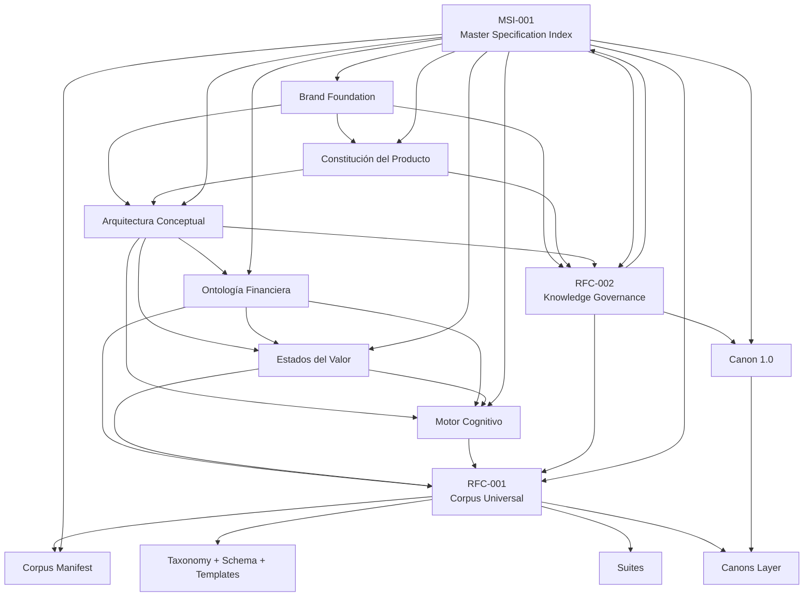

# Master Specification Index (MSI)

Estado: oficial
Identificador: MSI-001
Versión: 1.0.0
Fecha: 2 de julio de 2026
Propietario conceptual: Doleth

---

## 0. Mandato

Este documento es punto de entrada oficial a la especificación de Doleth.

No agrega teoría.
No modifica ontología.
No modifica governance.

Su trabajo es:

- inventariar
- ordenar
- relacionar
- dar trazabilidad
- orientar lectura humana o de IA

Si una persona nueva entra a Doleth, debe empezar acá.

---

## 1. Inventario completo

### 1.1 Regla de lectura del inventario

Cuando un artefacto no declara versión propia dentro de su archivo, MSI le asigna **versión baseline administrativa** para trazabilidad.

Eso no cambia su contenido.
Solo evita ambigüedad operativa.

Los estados usados acá se definen en sección 3.

### 1.2 Artefactos maestros

| Nombre | ID | Versión | Estado | Autoridad | Propietario conceptual | Depende de | Es dependencia de |
|---|---|---:|---|---|---|---|---|
| Brand Foundation | `DOC-BRAND-001` | `1.0.0` | `Frozen` | Máxima sobre identidad | Brand / Product | Ninguno | Constitución, Arquitectura, RFC-002, MSI |
| Constitución del Producto | `DOC-PRODUCT-001` | `1.0.0` | `Stable` | Máxima sobre misión y dirección de producto | Product | Brand Foundation | Arquitectura, RFC-002, MSI |
| Arquitectura Conceptual | `DOC-ARCH-001` | `1.0.0` | `Stable` | Máxima sobre marco conceptual superior | Concept | Brand Foundation, Constitución | Ontología, Estados, Motor, RFC-002, MSI |
| Ontología Financiera | `DOC-ONTO-001` | `1.0.0` | `Candidate` | Máxima sobre primitives y eventos | Concept / Ontology | Arquitectura | Estados, Motor, RFC-001, Canon 1.0, MSI |
| Estados del Valor | `DOC-STATE-001` | `1.0.0` | `Candidate` | Máxima sobre operatividad del valor | Concept / State Model | Arquitectura, Ontología | Motor, RFC-001, Canon 1.0, MSI |
| Motor Cognitivo | `DOC-COG-001` | `1.0.0` | `Candidate` | Máxima sobre hipótesis, verdad e inferencia | Concept / Cognition | Arquitectura, Ontología, Estados | RFC-001, Canon 1.0, MSI |
| RFC-001 Corpus Universal | `RFC-001` | `1.0.0` | `Candidate` | Máxima sobre infraestructura de validación conceptual | Spec / Validation | Ontología, Estados, Motor, Arquitectura | Corpus, Canon 1.0, MSI |
| RFC-002 Knowledge Governance | `RFC-002` | `1.0.0` | `Candidate` | Máxima sobre evolución del conocimiento | Spec / Governance | Brand Foundation, Constitución, Arquitectura, RFC-001 | MSI, futuros RFC, decisiones de cambio |
| Doleth Canon 1.0 | `CANON-001` | `1.0.0` | `Candidate` | Máxima sobre set fundacional de regresión conceptual | Spec / Validation | RFC-001, Ontología, Estados, Motor | Corpus canons, MSI, validación futura |
| Master Specification Index | `MSI-001` | `1.0.0` | `Stable` | Máxima sobre navegación y trazabilidad | Spec / Index | Todos los anteriores | Humanos, IAs, onboarding, auditorías |

### 1.3 Artefactos raíz del corpus

| Nombre | ID | Versión | Estado | Autoridad | Propietario conceptual | Depende de | Es dependencia de |
|---|---|---:|---|---|---|---|---|
| Corpus Manifest | `CORPUS-MANIFEST-001` | `0.1.0` | `Experimental` | Contrato operativo del corpus | Spec / Validation | RFC-001, RFC-002, Canon 1.0 | Schemas, suites, canons, MSI |
| Corpus README | `CORPUS-README-001` | `0.1.0` | `Experimental` | Entrada operativa del corpus | Spec / Validation | RFC-001, Manifest | Contributors, MSI |
| Corpus Changelog | `CORPUS-LOG-001` | `0.1.0` | `Experimental` | Historial local del corpus | Spec / Validation | Manifest | Auditoría, MSI |

### 1.4 Artefactos de governance del corpus

| Nombre | ID | Versión | Estado | Autoridad | Propietario conceptual | Depende de | Es dependencia de |
|---|---|---:|---|---|---|---|---|
| Contributing | `CORPUS-GOV-CONTRIB-001` | `0.1.0` | `Experimental` | Flujo de alta de casos | Spec / Validation | RFC-001, RFC-002 | Authoring, reviewers, MSI |
| Versioning | `CORPUS-GOV-VERSION-001` | `0.1.0` | `Experimental` | Reglas locales de versionado del corpus | Spec / Validation | RFC-001, RFC-002 | Manifest, canons, MSI |
| Deduplication | `CORPUS-GOV-DEDUP-001` | `0.1.0` | `Experimental` | Reglas de duplicidad conceptual | Spec / Validation | RFC-001 | Review de escenarios, MSI |
| Breakage Rules | `CORPUS-GOV-BREAK-001` | `0.1.0` | `Experimental` | Taxonomía de ruptura conceptual local | Spec / Validation | RFC-001, RFC-002 | Review de escenarios, MSI |

### 1.5 Taxonomy, schema y templates

| Nombre | ID | Versión | Estado | Autoridad | Propietario conceptual | Depende de | Es dependencia de |
|---|---|---:|---|---|---|---|---|
| Domains Taxonomy | `CORPUS-TAX-DOMAINS-001` | `1.0.0` | `Candidate` | Clasificación de suites | Spec / Validation | RFC-001 | Suites, canons, MSI |
| Tags Taxonomy | `CORPUS-TAX-TAGS-001` | `1.0.0` | `Candidate` | Clasificación axial de escenarios | Spec / Validation | RFC-001 | Scenario template, future cases, MSI |
| Invariants Taxonomy | `CORPUS-TAX-INV-001` | `1.0.0` | `Candidate` | Invariantes validatorios | Spec / Validation | Ontología, Estados, Motor, RFC-001 | Cases, canons, MSI |
| Failure Modes Taxonomy | `CORPUS-TAX-FAIL-001` | `1.0.0` | `Candidate` | Tipos de fallo conceptual | Spec / Validation | RFC-001, RFC-002 | Review, breakage analysis, MSI |
| Scenario Schema | `CORPUS-SCHEMA-SCENARIO-001` | `1.0.0` | `Candidate` | Contrato formal del escenario | Spec / Validation | RFC-001 | Templates, future automation, MSI |
| Scenario Template | `CORPUS-TPL-SCENARIO-001` | `1.0.0` | `Experimental` | Plantilla de authoring de casos | Spec / Validation | Schema, Tags, Invariants | Authoring, MSI |
| Domain Template | `CORPUS-TPL-DOMAIN-001` | `1.0.0` | `Experimental` | Plantilla de dominios | Spec / Validation | RFC-001 | Nuevos dominios, MSI |
| Review Checklist | `CORPUS-TPL-REVIEW-001` | `1.0.0` | `Experimental` | Checklist de revisión | Spec / Validation | RFC-001, RFC-002 | Review humano, MSI |

### 1.6 Suites conceptuales

| Nombre | ID | Versión | Estado | Autoridad | Propietario conceptual | Depende de | Es dependencia de |
|---|---|---:|---|---|---|---|---|
| Suite 00 Axiomas y límites | `SUITE-00` | `0.1.0` | `Experimental` | Cobertura de invariantes fundacionales | Spec / Validation | Domains, Invariants, RFC-001 | Canon 1.0 futuro, MSI |
| Suite 10 Verbos económicos | `SUITE-10` | `0.1.0` | `Experimental` | Cobertura de verbos y secuencias mínimas | Spec / Validation | Ontología, Domains, RFC-001 | Canon 1.0 futuro, MSI |
| Suite 20 Máquina de estados | `SUITE-20` | `0.1.0` | `Experimental` | Cobertura de transiciones del valor | Spec / Validation | Estados, Domains, RFC-001 | Canon 1.0 futuro, MSI |
| Suite 30 Tiempo y firmeza | `SUITE-30` | `0.1.0` | `Experimental` | Cobertura temporal y de certeza | Spec / Validation | Arquitectura, Estados, Motor, RFC-001 | Canon 1.0 futuro, MSI |
| Suite 40 Esferas y contrapartes | `SUITE-40` | `0.1.0` | `Experimental` | Cobertura de mundos financieros y agentes | Spec / Validation | Arquitectura, Ontología, RFC-001 | Canon 1.0 futuro, MSI |
| Suite 50 Evidencia e inferencia | `SUITE-50` | `0.1.0` | `Experimental` | Cobertura de señales, hipótesis y convergencia | Spec / Validation | Motor, RFC-001 | Canon 1.0 futuro, MSI |
| Suite 60 Presión de decisión | `SUITE-60` | `0.1.0` | `Experimental` | Cobertura de decisiones derivadas | Spec / Validation | Arquitectura, Motor, RFC-001 | Canon 1.0 futuro, MSI |
| Suite 70 Instrumentos y regímenes | `SUITE-70` | `0.1.0` | `Experimental` | Cobertura institucional y regulatoria | Spec / Validation | Ontología, RFC-001 | Canon 1.0 futuro, MSI |
| Suite 80 Vidas compuestas | `SUITE-80` | `0.1.0` | `Experimental` | Cobertura de trayectorias largas | Spec / Validation | Todas las normativas, RFC-001 | Canon futuro, MSI |
| Suite 90 Casos que rompen | `SUITE-90` | `0.1.0` | `Experimental` | Cobertura de límites y conflictos | Spec / Validation | RFC-001, RFC-002 | Canon futuro, MSI |
| Shared Assets | `SUITE-SHARED` | `0.1.0` | `Experimental` | Reuso no normativo | Spec / Validation | RFC-001 | Suites, MSI |

### 1.7 Artefactos de canons

| Nombre | ID | Versión | Estado | Autoridad | Propietario conceptual | Depende de | Es dependencia de |
|---|---|---:|---|---|---|---|---|
| Canons README | `CANONS-README-001` | `1.0.0` | `Candidate` | Entrada a layer de canons | Spec / Validation | RFC-001, Canon 1.0 | Canon manifests, MSI |
| Canon 1.0 Manifest | `CANON-MANIFEST-001` | `1.0.0` | `Candidate` | Contrato operativo del canon | Spec / Validation | Doleth Canon 1.0, RFC-001 | Future cases, gates, MSI |
| Canon 1.0 README | `CANON-README-001` | `1.0.0` | `Candidate` | Entrada operativa del canon | Spec / Validation | Doleth Canon 1.0, Manifest | Contributors, MSI |

---

## 2. Grafo de dependencias

### 2.1 Mapa estructural

### 2.2 Qué cambia con bajo radio de impacto

Puede cambiar con impacto acotado:

- changelog local del corpus
- templates
- checklists
- notes operativas
- suites vacías

### 2.3 Qué cambia con alto radio de impacto

Tiene alto radio:

- Brand Foundation
- Constitución
- Arquitectura
- Ontología
- Estados
- Motor Cognitivo
- RFC-001
- RFC-002
- Canon 1.0

### 2.4 Qué es verdaderamente fundacional

Fundacional duro:

- Brand Foundation
- Constitución del Producto
- Arquitectura Conceptual
- Ontología Financiera
- Estados del Valor
- Motor Cognitivo
- RFC-002

Fundacional de validación:

- RFC-001
- Canon 1.0

---

## 3. Estados de madurez

### 3.1 Draft

Artefacto iniciado pero todavía no apto para gobernar decisiones.

### 3.2 Experimental

Artefacto utilizable para exploración o scaffold.
Todavía no debe bloquear decisiones mayores.

### 3.3 Candidate

Artefacto conceptualmente serio, con forma estable, pendiente de ratificación o de población real suficiente.

### 3.4 Stable

Artefacto aceptado como referencia vigente.
Puede evolucionar, pero ya gobierna decisiones ordinarias.

### 3.5 Frozen

Artefacto congelado como contrato intelectual.
Solo cambia por RFC explícito, con análisis de compatibilidad y migración.

### 3.6 Deprecated

Artefacto ya no debe usarse para decisiones nuevas, pero se conserva por trazabilidad.

### 3.7 Archived

Artefacto fuera de uso activo, preservado solo por historia o auditoría.

### 3.8 Lectura actual del sistema

- `Frozen`: Brand Foundation
- `Stable`: Constitución, Arquitectura, MSI
- `Candidate`: Ontología, Estados, Motor, RFC-001, RFC-002, Canon 1.0, taxonomy base, schema base, layer de canons
- `Experimental`: corpus operativo, suites, templates, governance local del corpus

---

## 4. Matriz de trazabilidad

### 4.1 Documentos maestros

| Documento | Problema que resuelve | Valida | Consume | Produce | RFC que lo gobierna | Canon que utiliza |
|---|---|---|---|---|---|---|
| Brand Foundation | Fija identidad y narrativa de marca | No valida; orienta | Ninguno | Contrato de marca | RFC-002 | Ninguno |
| Constitución del Producto | Fija misión, wedge y dirección | No valida; orienta | Brand Foundation | Contrato de producto | RFC-002 | Ninguno |
| Arquitectura Conceptual | Fija modelo madre del sistema | Coherencia conceptual superior | Brand Foundation, Constitución | Marco para normativas | RFC-002 | Ninguno |
| Ontología Financiera | Fija entities, verbs y gramática | Primitives y eventos | Arquitectura | Lenguaje formal base | RFC-002 | Canon 1.0 futuro directo |
| Estados del Valor | Fija operatividad y transiciones | Consistencia de estado | Arquitectura, Ontología | Máquina de estados | RFC-002 | Canon 1.0 futuro directo |
| Motor Cognitivo | Fija hipótesis, verdad y trazabilidad | Política cognitiva | Arquitectura, Ontología, Estados | Teoría de inferencia | RFC-002 | Canon 1.0 futuro directo |
| RFC-001 | Fija corpus, suites, schemas y canons | Estructura validatoria | Ontología, Estados, Motor | Sistema de validación conceptual | RFC-002 | Canon 1.0 |
| RFC-002 | Fija evolución del conocimiento | Proceso y compatibilidad | Brand, Constitución, Arquitectura, RFC-001 | Gobernanza de especificación | Se gobierna a sí mismo hasta supersession | Todos los canons futuros |
| Doleth Canon 1.0 | Fija 50 casos fundacionales | Regresión conceptual fundacional | RFC-001, Ontología, Estados, Motor | Columna vertebral validatoria | RFC-001, RFC-002 | Es canon propio |
| MSI | Fija trazabilidad y navegación | Integridad documental y discoverability | Todos los maestros | Índice oficial | RFC-002 | Canon 1.0 como referencia |

### 4.2 Artefactos de validación

| Documento/artefacto | Problema que resuelve | Valida | Consume | Produce | RFC que lo gobierna | Canon que utiliza |
|---|---|---|---|---|---|---|
| Corpus Manifest | Evita corpus amorfo | Contrato local del corpus | RFC-001, RFC-002 | Punto de control operativo | RFC-001, RFC-002 | Canon 1.0 activo |
| Governance local del corpus | Evita authoring inconsistente | Flujo de escenarios | RFC-001, RFC-002 | Reglas operativas | RFC-001, RFC-002 | Canon 1.0 indirecto |
| Taxonomy | Evita clasificación caótica | Ejes de cobertura y fallos | RFC-001, normativas | Lenguaje validatorio | RFC-001 | Canon 1.0 indirecto |
| Scenario Schema | Evita escenarios no comparables | Estructura formal de casos | RFC-001, taxonomy | Contrato automatizable | RFC-001 | Canon 1.0 futuro directo |
| Suites | Evitan cobertura sin mapa | Familias de escenarios | RFC-001, taxonomy | Organización expansible | RFC-001 | Canon 1.0 futuro mapeado |
| Canons Layer | Evita mezclar universo y columna vertebral | Gates permanentes | RFC-001, RFC-002, Canon docs | Subsets congelados | RFC-001, RFC-002 | Canon 1.0 |

---

## 5. Freeze Map

| Artefacto | Estado de freeze | Qué queda congelado | Qué puede evolucionar | Condición para romper freeze |
|---|---|---|---|---|
| Brand Foundation | `Frozen` | Identidad, categoría, promesa, tono | Nada semántico; solo clarificaciones | RFC explícito + análisis de compatibilidad + migración narrativa |
| Constitución del Producto | `Stable` | Misión y dirección base | Wording y precisión compatible | RFC si cambia misión, wedge o tesis |
| Arquitectura Conceptual | `Stable` | Modelo madre de posición, tiempo y certeza | Ejemplos y refinamientos compatibles | RFC si cambia tesis estructural |
| Ontología Financiera | `Candidate` | Primitives actuales como baseline | Aclaraciones y extensiones compatibles | RFC + validación contra canon/corpus si cambia átomo o verbo |
| Estados del Valor | `Candidate` | Estados base y transiciones baseline | Aclaraciones, casos y límites | RFC si cambia máquina base |
| Motor Cognitivo | `Candidate` | Trazabilidad, hipótesis, verdad provisional | Heurísticas compatibles | RFC si cambia teoría de verdad o policy de incertidumbre |
| RFC-001 | `Candidate` | Modelo base del corpus | Suites, templates, metadata | RFC si cambia arquitectura validatoria |
| Canon 1.0 | `Candidate` | Lista fundacional de 50 casos | Metadata y mapping compatibles | Nuevo canon o RFC si cambia columna vertebral |
| RFC-002 | `Candidate` | Jerarquía y proceso de cambio | Clarificaciones compatibles | RFC de governance que lo superseda |
| MSI | `Stable` | Índice y trazabilidad oficial | Inventario y estado a medida que crece sistema | RFC si cambia rol o autoridad del índice |
| Corpus operativo | `Experimental` | Nada fundacional todavía | Puede expandirse ampliamente | Debe obedecer freeze superior |

### 5.1 Lectura dura

Hoy solo hay un freeze explícito y completo:

- Brand Foundation

Hay freeze parcial o implícito en:

- Canon 1.0 como intención
- language base del corpus

Todavía falta formalizar freeze total de:

- Ontología
- Estados
- Motor Cognitivo

---

## 6. Roadmap restante

### 6.1 Capa Especificación

Falta realmente:

1. materializar 50 escenarios reales de Canon 1.0
2. crear manifest maestro de versión agregada de toda la especificación
3. crear índice maestro de autoridad y supersession machine-readable
4. fijar estados formales de RFC: draft, candidate, ratified, superseded, withdrawn
5. definir formato de migration note conceptual
6. declarar freeze explícito de ontología, estados y motor cuando canon base exista
7. diseñar auditoría periódica de coherencia de la especificación

### 6.2 Capa Producto

Falta para volver Doleth aplicación usable:

1. definir primer problema operativo que el usuario resuelve en menos de 5 minutos
2. definir primer input real soportado
3. diseñar primera representación visible de verdad financiera
4. diseñar primer loop de corrección usuario-sistema
5. definir primer pipeline de ingestión -> interpretación -> estado -> respuesta
6. elegir una sola vertical inicial de uso real
7. instrumentar validación con usuarios reales

### 6.3 Prioridad para acercarse al primer usuario real

Orden recomendado:

1. Canon 1.0 materializado
2. primer flujo de producto ultra estrecho
3. test con usuarios reales
4. solo después ampliar especificación si realidad lo exige

---

## 7. Recomendación estratégica

### 7.1 Evaluación crítica

Doleth ya tiene base conceptual inusualmente fuerte.

Tiene:

- identidad congelada
- tesis de producto
- arquitectura conceptual
- ontología
- máquina de estados
- teoría cognitiva
- corpus framework
- canon fundacional
- governance de evolución
- índice maestro

Eso ya supera con mucho el mínimo necesario para empezar construcción seria.

### 7.2 Respuesta explícita

**No es momento de seguir expandiendo especificación de forma amplia.**

**Sí es momento de empezar construcción del producto.**

### 7.3 Justificación

Razones:

1. riesgo principal ya no es falta de teoría; es falta de contacto con realidad operativa
2. sin usuarios, parte de especificación va a optimizar elegancia interna más que verdad empírica
3. Canon 1.0 todavía no está materializado, así que siguiente aprendizaje fuerte no sale de más documentos sino de validación
4. producto real va a revelar qué parte de la teoría resiste fricción, ruido y ambigüedad verdadera
5. seguir especificando demasiado temprano aumenta riesgo de rigidez prematura

### 7.4 Recomendación final

Parar expansión horizontal de especificación.

Seguir solo con tres trabajos de spec estrictamente necesarios:

- materializar Canon 1.0 en escenarios reales
- crear versión agregada machine-readable de la especificación
- formalizar estados de RFC

Todo lo demás debe moverse a construcción de producto.

No porque la especificación esté completa para siempre.
Sino porque ya es suficientemente fuerte como para empezar a confrontarse con realidad.

Ese es siguiente cuello de botella verdadero.

---

## 8. Resultado normativo

Este documento se convierte en índice oficial de toda la especificación de Doleth.

Toda persona humana o IA que necesite comprender proyecto debe empezar acá.

Orden recomendado de lectura:

1. `master-specification-index.md`
2. `doleth-brand-foundation.md`
3. `doleth-constitucion-producto.md`
4. `doleth-arquitectura-conceptual.md`
5. `doleth-ontologia-financiera.md`
6. `doleth-estados-del-valor.md`
7. `doleth-motor-cognitivo.md`
8. `rfc-002-knowledge-governance.md`
9. `rfc-001-corpus-universal-de-la-vida-financiera.md`
10. `doleth-canon-1.0.md`
