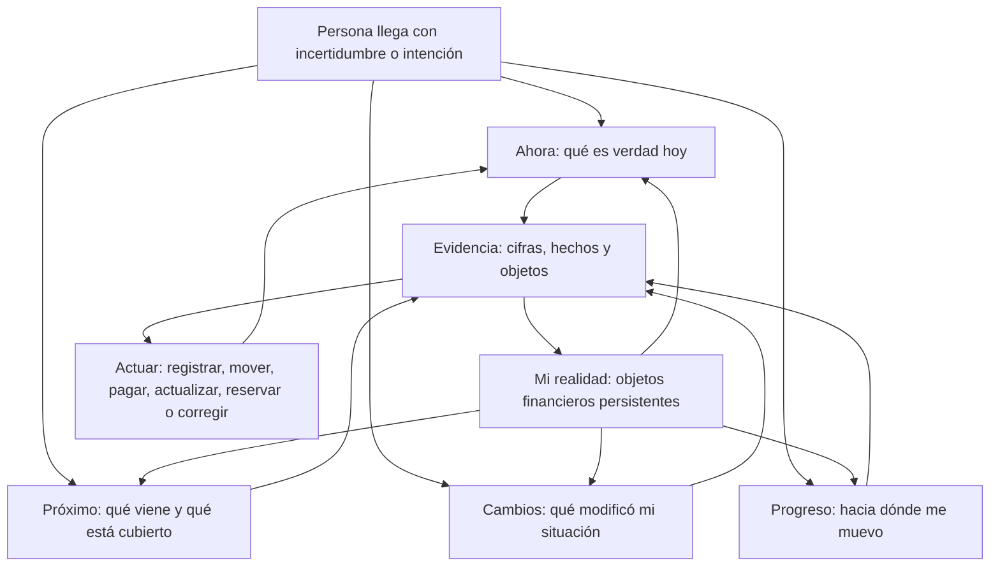

# UX-004 — Modelo de Navegación por Decisiones

Estado: oficial  
Fecha: 2 de julio de 2026  
Autoridad: modelo mental y navegación global de Doleth  
Depende de: Brand Foundation, `PRD-002`, `DOLETH PRODUCT BLUEPRINT`, `PRODUCT RESEARCH 001` y `SCREEN DESIGN 001`  

## 0. Pregunta central

**¿Debe Doleth organizarse por módulos o por decisiones?**

Respuesta:

**Doleth debe organizar entrada cotidiana por preguntas humanas y administración profunda por objetos financieros.**

Navegación puramente modular no alcanza porque obliga a persona a construir respuesta recorriendo partes.

Navegación puramente basada en preguntas tampoco alcanza porque preguntas se superponen y objetos persistentes necesitan lugar estable.

Modelo definitivo es híbrido:

1. **orientación por preguntas;**
2. **profundidad por realidad financiera;**
3. **acciones transversales;**
4. **evidencia siempre accesible.**

“Por decisiones” no significa que Doleth decide. Significa que producto comienza desde decisión o incertidumbre que persona intenta resolver.

---

## 1. Cómo piensa realmente una persona

## 1.1 Persona no comienza por estructura

En uso cotidiano, persona rara vez piensa:

- voy a revisar módulo de cuentas;
- ahora quiero entrar en módulo de deudas;
- después consultaré módulo de inversiones.

Piensa desde una tensión concreta:

- necesito saber si llego a próximos pagos;
- algo cambió y no entiendo por qué;
- quiero confirmar cuánto puedo usar;
- tengo que pagar algo;
- quiero saber si estoy avanzando;
- saldo no coincide con recuerdo;
- debo preparar próximo mes.

Módulo aparece después, cuando necesita localizar origen o modificar elemento.

## 1.2 Pensamiento financiero cotidiano tiene cinco disparadores

### 1. Incertidumbre

“No sé exactamente cómo estoy.”

Persona busca orientación general antes que detalle.

### 2. Urgencia

“Hay algo que pagar, cobrar o resolver.”

Atención se dirige a fecha, monto y consecuencia.

### 3. Cambio

“Mi situación es distinta y quiero entender causa.”

Persona reconstruye hechos, no categorías abstractas.

### 4. Intención

“Quiero comprar, ahorrar, cancelar o preparar algo.”

Busca margen y consecuencias, no instrucciones automáticas.

### 5. Revisión

“Quiero comprobar que todo sigue correcto.”

Busca inconsistencias, faltantes y evolución.

## 1.3 Persona organiza dinero por tiempo y propósito

Primera organización mental suele ser temporal:

- hoy;
- antes de próximo cobro;
- esta semana;
- este mes;
- más adelante.

Segunda organización es por propósito:

- disponible;
- reservado;
- comprometido;
- invertido;
- destinado a deuda;
- destinado a objetivo.

Ubicación institucional —banco, billetera, efectivo, tarjeta— importa cuando necesita actuar, verificar o corregir.

## 1.4 Emoción precede análisis

Antes de abrir producto, persona suele traer alguna combinación de:

- duda;
- presión;
- curiosidad;
- culpa;
- desconfianza;
- necesidad de control.

Primera respuesta debe reducir incertidumbre. Exigir elección de módulo transfiere trabajo de síntesis a usuario antes de darle valor.

## 1.5 Atención sigue riesgo y proximidad

Persona prioriza:

1. lo vencido;
2. lo que vence pronto;
3. lo que puede dejarla sin liquidez;
4. lo que no coincide;
5. lo que cambió de forma material;
6. progreso de largo plazo.

Aplicación no debe dar mismo peso a cotización de inversión y pago que vence mañana.

## 1.6 Persona necesita respuesta antes que exploración

Secuencia mental correcta:

```text
Pregunta
-> respuesta
-> explicación
-> evidencia
-> acción
```

Navegación modular suele invertir secuencia:

```text
Elegir módulo
-> buscar objeto
-> interpretar datos
-> construir respuesta
-> actuar
```

## 1.7 Pero persona también piensa en objetos

Cuando tarea es concreta, pensamiento cambia:

- quiero ver mi Visa;
- necesito actualizar cuenta Galicia;
- quiero vender BTC;
- debo corregir préstamo de Juan;
- quiero revisar objetivo del viaje.

Esto impide adoptar navegación puramente por preguntas.

Conclusión psicológica:

**Personas entran por preguntas, pero administran mediante objetos reconocibles.**

---

## 2. Preguntas por frecuencia

Frecuencia depende de vida financiera, pero orden siguiente representa uso general.

## 2.1 Durante un día

| Frecuencia | Pregunta humana | Necesidad real |
|---|---|---|
| 1 | ¿Cuánto puedo usar sin comprometer lo próximo? | margen actual |
| 2 | ¿Hay algo que necesita atención hoy? | urgencia |
| 3 | ¿Qué cambió desde última vez? | actualización |
| 4 | ¿Qué pago o cobro se acerca? | anticipación |
| 5 | ¿Mis cifras siguen actualizadas? | confianza |
| 6 | ¿Puedo realizar esta compra o transferencia sin desordenarme? | evaluar decisión propia |
| 7 | ¿Por qué este saldo no coincide? | corrección |
| 8 | ¿Dónde está dinero que necesito? | localización |

### Observación

“¿Puedo gastar?” no debe convertirse en respuesta binaria del producto. Doleth muestra margen, compromisos y efecto. Persona decide.

## 2.2 Durante una semana

| Frecuencia | Pregunta humana | Necesidad real |
|---|---|---|
| 1 | ¿Qué debo cubrir en próximos siete días? | preparación |
| 2 | ¿Estoy más holgado o más ajustado que semana pasada? | dirección corta |
| 3 | ¿Qué movimiento explica cambio principal? | causalidad |
| 4 | ¿Hay cuentas, tarjetas o deudas que debería revisar? | mantenimiento |
| 5 | ¿Qué gasto o cobro fue diferente a lo esperado? | anomalía práctica |
| 6 | ¿Avancé en algo que me importa? | progreso |
| 7 | ¿Qué parte de dinero ya tiene destino? | asignación |
| 8 | ¿Mi deuda subió o bajó? | control de obligaciones |

## 2.3 Durante un mes

| Frecuencia | Pregunta humana | Necesidad real |
|---|---|---|
| 1 | ¿Qué entró, qué salió y cuánto conservé? | cierre de flujo |
| 2 | ¿Por qué mi posición terminó mejor o peor? | explicación global |
| 3 | ¿Cuánto debo al comenzar próximo mes? | continuidad |
| 4 | ¿Cómo cambiaron inversiones y patrimonio? | evolución de capital |
| 5 | ¿Qué compromisos próximos ya están cubiertos? | preparación mensual |
| 6 | ¿Qué debería corregir antes de cerrar período? | calidad de información |
| 7 | ¿Qué objetivo avanzó y cuál quedó detenido? | progreso de propósito |
| 8 | ¿Qué decisión del mes tuvo mayor efecto? | aprendizaje personal |
| 9 | ¿Qué parte de mi situación sigue sin registrar? | cobertura |
| 10 | ¿Qué quiero preparar para próximo mes? | intención futura |

## 2.4 Familias de preguntas

Preguntas diarias, semanales y mensuales se reducen a cinco familias estables:

1. **Estado:** qué es verdad ahora.
2. **Atención:** qué requiere acción o revisión.
3. **Cambio:** qué ocurrió y qué efecto tuvo.
4. **Futuro:** qué viene y qué está cubierto.
5. **Dirección:** cómo evoluciona y hacia qué propósito.

Familias son más estables que listas de funcionalidades y más escalables que una pregunta literal por destino.

---

## 3. Navegación completamente basada en preguntas

Este modelo se analiza primero sin módulos visibles.

## 3.1 ¿Qué es verdad ahora?

Reúne:

- dinero disponible;
- posición actual;
- deuda total;
- compromisos inmediatos;
- estado de actualización;
- urgencia principal.

Trabajo humano: orientarse.

## 3.2 ¿Qué necesita mi atención?

Reúne:

- vencimientos;
- pagos pendientes;
- cobros esperados;
- diferencias de saldo;
- información desactualizada;
- operaciones incompletas.

Trabajo humano: resolver.

## 3.3 ¿Qué cambió mi situación?

Reúne:

- movimientos recientes;
- diferencias desde última revisión;
- variación semanal;
- cambios de deuda;
- cambios de valuación;
- causas principales.

Trabajo humano: comprender.

## 3.4 ¿Qué viene después?

Reúne:

- próximos siete días;
- resto del mes;
- cuotas;
- tarjetas;
- préstamos;
- ingresos esperados;
- renovaciones;
- compromisos futuros.

Trabajo humano: prepararse.

## 3.5 ¿Hacia dónde estoy avanzando?

Reúne:

- trayectoria de patrimonio;
- evolución de ahorro;
- reducción de deuda;
- objetivos;
- reservas;
- comparación entre períodos.

Trabajo humano: evaluar dirección.

## 3.6 ¿De qué está hecha mi realidad?

Reúne:

- lugares donde vive dinero;
- tarjetas;
- deudas y cobros;
- inversiones;
- activos;
- objetivos;
- ámbitos y titularidad.

Trabajo humano: localizar y administrar.

### Problema detectado

Sexta pregunta reintroduce estructura. Esto no es falla de redacción. Es evidencia de que navegación puramente por preguntas no puede sostener administración profunda sin una capa de objetos.

## 3.7 Ventajas del modelo puro por preguntas

- coincide con motivo real de apertura;
- reduce necesidad de conocer estructura interna;
- cruza cuentas, deuda, tarjetas e inversiones para producir respuesta;
- facilita retorno cotidiano;
- prioriza tiempo y atención;
- encaja mejor con pantalla pequeña;
- diferencia Doleth de gestores modulares tradicionales.

## 3.8 Desventajas del modelo puro por preguntas

- misma información aparece en varias respuestas;
- preguntas se solapan;
- usuario puede no saber dónde editar objeto concreto;
- nombres largos pierden eficiencia con uso repetido;
- nuevas preguntas pueden multiplicar destinos;
- administración de cuenta, tarjeta o deuda queda escondida;
- enlaces profundos pierden lugar canónico;
- navegación puede cambiar cuando pregunta del momento cambia;
- escalabilidad depende de interpretación editorial constante.

## 3.9 Veredicto del modelo puro

Excelente para entrada y síntesis.

Insuficiente como estructura completa.

---

## 4. Navegación clásica basada en módulos

Modelo clásico organiza producto por objetos o funciones:

1. Panorama.
2. Cuentas.
3. Movimientos.
4. Tarjetas.
5. Deudas.
6. Inversiones.
7. Patrimonio.
8. Objetivos.
9. Agenda.
10. Reportes.

## 4.1 Ventajas

- cada objeto tiene lugar estable;
- usuario experto aprende rutas previsibles;
- administración profunda resulta directa;
- producto puede crecer agregando dominios;
- ownership de información queda claro;
- búsqueda y soporte son más fáciles;
- acciones específicas viven cerca de objeto;
- evita duplicar edición en múltiples contextos.

## 4.2 Desventajas

- obliga a usuario a saber qué módulo contiene respuesta;
- divide una misma realidad en silos visibles;
- preguntas cruzadas requieren recorrer varias secciones;
- Inicio tiende a convertirse en dashboard de widgets;
- cantidad de módulos crece con producto;
- navegación mobile se llena rápido;
- módulos de baja frecuencia compiten con necesidades diarias;
- estructura de organización domina experiencia;
- usuario vuelve para administrar datos, no para recuperar claridad.

## 4.3 Ejemplo de fricción modular

Pregunta:

> ¿Estoy más ajustado que semana pasada?

Modelo modular obliga a consultar:

- cuentas para saldo;
- tarjetas para consumos;
- deudas para próximos pagos;
- inversiones para valuación;
- actividad para cambios;
- reportes para comparación.

Producto posee datos, pero usuario debe fabricar respuesta.

## 4.4 Veredicto del modelo modular

Excelente para profundidad y mantenimiento.

Insuficiente como experiencia principal.

---

## 5. Comparación

| Criterio | Preguntas puras | Módulos puros |
|---|---|---|
| Coincide con intención inicial | Muy alto | Bajo |
| Velocidad para obtener respuesta | Alta | Media o baja |
| Administración de objeto concreto | Baja | Muy alta |
| Estabilidad de ubicación | Media | Muy alta |
| Síntesis entre dominios | Muy alta | Baja |
| Escalabilidad funcional | Media | Alta |
| Claridad mobile | Alta al comienzo | Baja cuando crece |
| Aprendizaje inicial | Bajo | Medio |
| Eficiencia para usuario experto | Media | Alta |
| Riesgo de duplicación | Alto | Bajo |
| Capacidad de priorizar urgencia | Muy alta | Media |
| Capacidad de responder “¿cómo estoy?” | Muy alta | Depende de dashboard |
| Descubrimiento de capacidades | Medio | Alto |
| Consistencia de edición | Baja | Alta |
| Valor cotidiano | Alto | Medio |

## 5.1 Falso dilema

Elegir solo una opción confunde dos trabajos distintos:

- **orientarse y decidir;**
- **administrar y corregir.**

Preguntas resuelven primero.

Módulos resuelven segundo.

Mejor producto no obliga a misma navegación para ambos trabajos.

---

## 6. Modelo elegido

## 6.1 Decisión

Si hoy construyera mejor aplicación financiera posible, elegiría modelo híbrido con preguntas como navegación primaria y objetos como navegación estructural secundaria.

No elegiría preguntas literales como etiquetas permanentes para todo. Elegiría territorios cortos que representan familias de preguntas.

## 6.2 Por qué no módulos como capa principal

Porque Doleth promete claridad integral. Si usuario debe entrar en cinco módulos para entender situación, producto incumple promesa aunque cada módulo sea excelente.

## 6.3 Por qué no preguntas como única capa

Porque vida financiera tiene objetos persistentes:

- una cuenta debe actualizarse;
- una tarjeta debe pagarse;
- una deuda tiene condiciones;
- una inversión tiene posición;
- un activo tiene valuación;
- un objetivo tiene reserva.

Ocultarlos completamente vuelve producto mágico al principio y confuso después.

## 6.4 Principio rector

**Entrar por lo que persona necesita entender; profundizar por aquello que compone su realidad.**

## 6.5 Cambio respecto de modelo anterior

Modelo anterior definía cinco destinos visibles:

- Inicio;
- Actividad;
- Posición;
- Agenda;
- Reportes.

Estructura nueva conserva intención útil, pero cambia significado:

- Inicio se convierte en **Ahora**;
- Actividad se integra en **Cambios**;
- Agenda se convierte en **Próximo**;
- Reportes se divide entre **Cambios** y **Progreso**;
- Posición se convierte en capa estructural **Mi realidad**;
- Registrar deja de ser destino y permanece acción transversal.

No cambia modelo financiero. Cambia forma humana de entrar.

---

## 7. Modelo híbrido definitivo

## 7.1 Capa primaria: orientación por decisiones

Cuatro territorios responden uso cotidiano.

### Ahora

Pregunta madre:

**¿Qué es verdad hoy?**

Incluye:

- disponibilidad;
- presión inmediata;
- atención;
- estado de información;
- situación resumida.

Momento de uso:

- abrir Doleth;
- evaluar margen;
- recuperar orientación.

### Próximo

Pregunta madre:

**¿Qué viene y qué está cubierto?**

Incluye:

- pagos;
- cobros;
- cuotas;
- cierres;
- vencimientos;
- compromisos;
- reservas necesarias.

Momento de uso:

- preparar semana;
- anticipar mes;
- resolver urgencia.

### Cambios

Pregunta madre:

**¿Qué modificó mi situación?**

Incluye:

- actividad;
- variación desde última revisión;
- causas;
- diferencias;
- revisión y corrección;
- cierre mensual.

Momento de uso:

- entender movimiento;
- verificar información;
- explicar mejora o deterioro.

### Progreso

Pregunta madre:

**¿Hacia dónde se mueve mi vida financiera?**

Incluye:

- evolución de liquidez;
- patrimonio;
- deuda;
- ahorro;
- objetivos;
- comparación de períodos.

Momento de uso:

- revisar semana o mes;
- evaluar trayectoria;
- preparar decisiones de largo plazo.

## 7.2 Capa estructural: Mi realidad

Pregunta madre:

**¿De qué está compuesta mi situación?**

No es quinto territorio equivalente. Es mapa estable que sostiene cuatro anteriores.

Contiene objetos reconocibles:

- dinero y cuentas;
- tarjetas y cuotas;
- deudas y cobros;
- inversiones;
- patrimonio;
- objetivos y reservas.

Función:

- localizar;
- administrar;
- corregir;
- actualizar;
- profundizar.

Usuario llega a Mi realidad de dos formas:

1. directamente, cuando ya sabe qué objeto busca;
2. desde respuesta, cuando quiere evidencia o acción específica.

## 7.3 Capa transversal: Actuar

No es lugar. Es verbo disponible desde contexto.

Acciones principales:

- registrar;
- mover;
- pagar;
- cobrar;
- actualizar;
- reservar;
- corregir.

Acción hereda contexto.

Ejemplos:

- desde Próximo, “pagar” conoce compromiso;
- desde cuenta, “mover” conoce origen;
- desde Cambios, “corregir” conoce operación;
- desde objetivo, “reservar” conoce propósito.

## 7.4 Capa de evidencia

Cada respuesta importante abre cadena:

```text
Conclusión
-> cifra
-> hechos que la forman
-> objetos afectados
-> acción posible
```

Evidencia evita que navegación por decisiones se vuelva opaca.

## 7.5 Por qué híbrido es superior

- persona no necesita conocer estructura para comenzar;
- usuario experto conserva acceso directo;
- objetos tienen hogar canónico;
- preguntas pueden cruzar dominios sin duplicar verdad;
- acciones no exigen volver a inicio;
- navegación principal permanece pequeña;
- producto puede crecer sin sumar destino por módulo;
- modelo funciona en mobile;
- Dashboard deja de ser único lugar de síntesis;
- futuro y pasado obtienen espacios claros.

## 7.6 Riesgos del híbrido

### Riesgo 1: duplicación

Misma deuda aparece en Ahora, Próximo, Cambios, Progreso y Mi realidad.

Control:

Cada territorio muestra lectura distinta. Edición estructural vive solo en Mi realidad.

### Riesgo 2: etiquetas abstractas

“Ahora”, “Cambios” o “Progreso” pueden parecer amplios.

Control:

Contenido inicial y lenguaje deben hacer pregunta madre evidente. Etiqueta corta sirve a uso repetido; pregunta explica primer uso.

### Riesgo 3: acción difícil de encontrar

Usuario puede no saber dónde pagar o actualizar.

Control:

Actuar permanece transversal y contextual.

### Riesgo 4: Mi realidad se convierte en menú de módulos

Control:

Mi realidad se usa para administración, no como puerta obligatoria para obtener respuestas.

---

## 8. Mapa completo de navegación mental

## 8.1 Ejes

Modelo se organiza sobre dos ejes humanos.

### Eje temporal

```text
Pasado reciente -------- Presente -------- Futuro próximo
     Cambios               Ahora               Próximo
```

### Eje de dirección

```text
Situación actual -------- Trayectoria -------- Propósito
      Ahora                 Progreso            Objetivos
```

### Eje estructural

```text
Mi realidad sostiene todos:
dinero + obligaciones + capital + patrimonio + propósitos
```

## 8.2 Mapa integral



## 8.3 Preguntas que resuelve cada territorio

| Territorio | Pregunta principal | Preguntas secundarias |
|---|---|---|
| Ahora | ¿Qué es verdad hoy? | ¿Cuánto está disponible? ¿Qué necesita atención? ¿La información es confiable? |
| Próximo | ¿Qué viene y qué está cubierto? | ¿Qué vence? ¿Qué cobraré? ¿Qué debo preparar? |
| Cambios | ¿Qué modificó mi situación? | ¿Qué pasó? ¿Por qué estoy distinto? ¿Qué debo corregir? |
| Progreso | ¿Hacia dónde me muevo? | ¿Mejoré? ¿Bajó deuda? ¿Avanzaron objetivos? |
| Mi realidad | ¿De qué está compuesta mi situación? | ¿Dónde está dinero? ¿Qué debo? ¿Qué poseo? ¿Qué está reservado? |
| Actuar | ¿Qué necesito hacer? | ¿Registrar, mover, pagar, cobrar, actualizar, reservar o corregir? |

## 8.4 Relación entre territorios

### Ahora -> Próximo

Disponible cobra sentido frente a compromisos.

### Ahora -> Cambios

Situación actual necesita explicación.

### Cambios -> Progreso

Hechos recientes forman trayectoria.

### Próximo -> Progreso

Compromisos y reservas conectan presente con propósito.

### Todos -> Mi realidad

Respuesta puede profundizar hasta objeto responsable.

### Actuar -> Todos

Acción actualiza realidad y devuelve usuario a pregunta original con resultado visible.

## 8.5 Reglas permanentes

1. Pregunta precede a estructura en uso cotidiano.
2. Objeto precede a pregunta en administración directa.
3. Cada objeto tiene hogar canónico único.
4. Una respuesta puede usar varios dominios sin duplicar registros.
5. Acción no es destino de navegación.
6. Resultado de acción vuelve a contexto que la originó.
7. Ahora nunca se convierte en feed.
8. Próximo nunca mezcla hecho realizado con esperado.
9. Cambios siempre puede explicar origen.
10. Progreso no usa score único.
11. Mi realidad no obliga recorrido para entender panorama.
12. Preguntas secundarias no crean destinos permanentes.
13. Urgencia puede alterar prioridad, no estructura completa.
14. Usuario experto puede llegar directo a objeto.
15. Usuario nuevo puede operar sin aprender nombres de módulos.
16. Mismos datos conservan mismo significado en todos los territorios.
17. Navegación no crece cuando se agrega nuevo tipo de activo o deuda.
18. Complejidad vive en profundidad, no en cantidad de entradas.

---

## 9. Decisión final

## 9.1 Qué gobierna producto

Doleth no se organiza visualmente como lista de módulos.

Se organiza alrededor de cuatro necesidades humanas:

1. entender presente;
2. anticipar futuro próximo;
3. explicar cambios;
4. evaluar progreso.

Módulos permanecen como estructura de administración dentro de Mi realidad.

## 9.2 Qué se descarta

- navegación principal con destino para cada módulo;
- navegación formada por preguntas literales ilimitadas;
- dashboard como único lugar donde módulos se conectan;
- menú “Más” que acumula dominios secundarios;
- acción Registrar como sección independiente;
- reportes aislados de preguntas sobre cambio y progreso.

## 9.3 Qué se conserva

- Dashboard como respuesta de Ahora;
- Agenda como base de Próximo;
- Actividad como evidencia de Cambios;
- Reportes como profundidad de Cambios y Progreso;
- Posición como base de Mi realidad;
- acciones operativas de Product Blueprint;
- ownership funcional de módulos detrás de experiencia.

---

## 10. Por qué una persona volvería todos los días

Persona vuelve porque situación financiera cambia aunque no tome una gran decisión.

- vencimiento se acerca;
- cobertura cambia;
- inversión modifica posición;
- deuda pesa distinto con paso del tiempo;
- semana mejora o se ajusta;
- objetivo se acerca o se aleja;
- dato puede quedar desactualizado;
- compromiso futuro empieza a importar hoy.

Doleth ofrece algo más valioso que actividad:

**orientación renovada.**

Cada apertura reduce cinco incertidumbres:

1. qué es verdad;
2. qué requiere atención;
3. qué cambió;
4. qué viene;
5. hacia dónde se mueve situación.

Persona no vuelve para alimentar sistema.

Vuelve para recuperar control, anticipar tensión y confirmar dirección.

Respuesta final:

**Una persona vuelve todos los días porque Doleth transforma una realidad financiera dispersa y cambiante en una posición comprensible, próxima y verificable.**

---

## 11. Declaración oficial

Modelo definitivo de navegación de Doleth queda establecido así:

```text
CAPA PRIMARIA
Ahora | Próximo | Cambios | Progreso

CAPA ESTRUCTURAL
Mi realidad

CAPA TRANSVERSAL
Actuar

CAPA DE CONFIANZA
Evidencia
```

Futuras pantallas deben ubicarse dentro de este modelo antes de diseñarse.

Si una pantalla no responde pregunta, no administra objeto, no permite acción o no aporta evidencia, no pertenece a navegación de Doleth.
